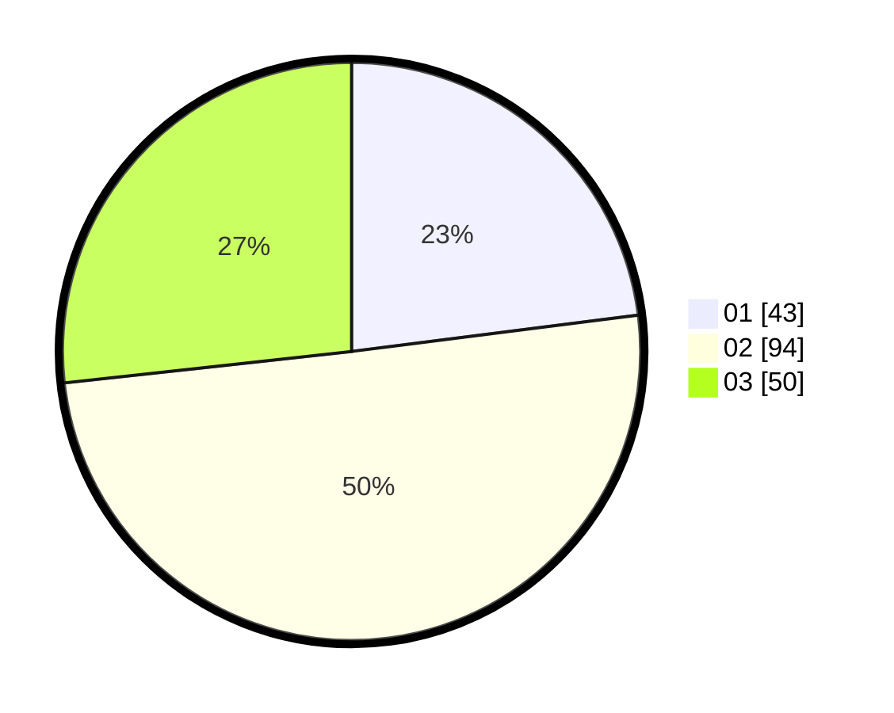

# Hasil

Hasil perolehan suara paslon dapat dilihat pada file paslon-01.txt, paslon-02.txt, dan paslon-03.txt.

Jika tidak ada, artinya data tersebut belum ada pada SIREKAP.

## Perolehan Suara

 * Paslon 01: **43**.
 * Paslon 02: **94**.
 * Paslon 03: **50**.

## Foto C Plano

https://sirekap-obj-formc.kpu.go.id/8ad6/pemilu/ppwp/31/73/04/10/06/3173041006064-20240214-221634--f0466dcc-f427-4cb6-8a0f-50ec989b6a12.jpg

https://sirekap-obj-formc.kpu.go.id/8ad6/pemilu/ppwp/31/73/04/10/06/3173041006064-20240214-221801--ebe325d9-a6ab-4623-9955-fd460302ea2c.jpg

https://sirekap-obj-formc.kpu.go.id/8ad6/pemilu/ppwp/31/73/04/10/06/3173041006064-20240214-221929--543a5635-57a1-432f-b220-c524f1208ce3.jpg
