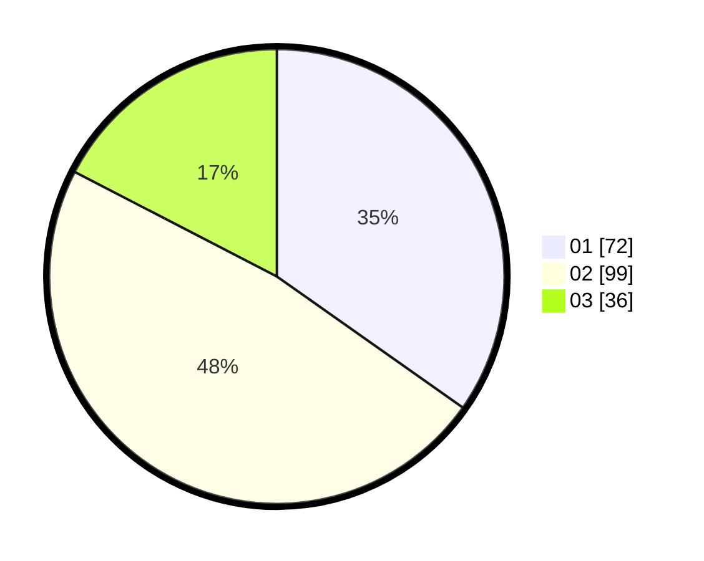

# Hasil

Hasil perolehan suara paslon dapat dilihat pada file paslon-01.txt, paslon-02.txt, dan paslon-03.txt.

Jika tidak ada, artinya data tersebut belum ada pada SIREKAP.

## Perolehan Suara

 * Paslon 01: **72**.
 * Paslon 02: **99**.
 * Paslon 03: **36**.

## Foto C Plano

https://sirekap-obj-formc.kpu.go.id/3912/pemilu/ppwp/31/73/04/10/06/3173041006067-20240214-195303--a6adf267-561b-4201-b7cc-b71317fbee43.jpg

https://sirekap-obj-formc.kpu.go.id/3912/pemilu/ppwp/31/73/04/10/06/3173041006067-20240214-214520--2906cb6f-6cae-404a-a99e-b3b7141dc981.jpg

https://sirekap-obj-formc.kpu.go.id/3912/pemilu/ppwp/31/73/04/10/06/3173041006067-20240214-195613--c9559c3e-fb9a-4e9c-a08a-65344537a5dc.jpg
