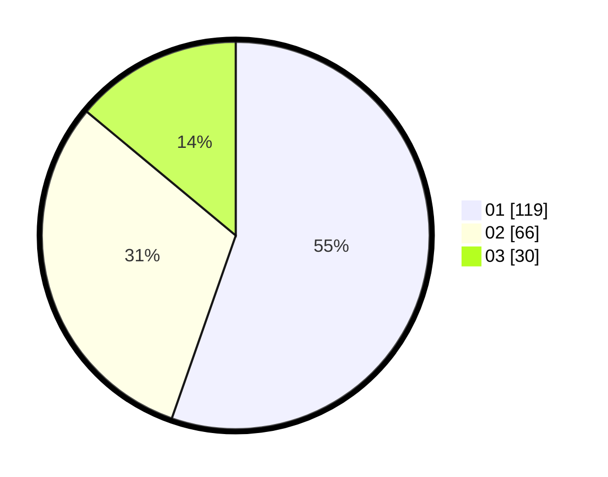

# Hasil

Hasil perolehan suara paslon dapat dilihat pada file paslon-01.txt, paslon-02.txt, dan paslon-03.txt.

Jika tidak ada, artinya data tersebut belum ada pada SIREKAP.

## Perolehan Suara

 * Paslon 01: **119**.
 * Paslon 02: **66**.
 * Paslon 03: **30**.

## Foto C Plano

https://sirekap-obj-formc.kpu.go.id/fbd8/pemilu/ppwp/31/73/04/10/06/3173041006068-20240216-202039--aa6fe85c-d663-4e3b-a294-8ea01a80e3c8.jpg

https://sirekap-obj-formc.kpu.go.id/fbd8/pemilu/ppwp/31/73/04/10/06/3173041006068-20240216-210253--2a86fd78-6704-4c1e-8292-07b5f39b9e06.jpg

https://sirekap-obj-formc.kpu.go.id/fbd8/pemilu/ppwp/31/73/04/10/06/3173041006068-20240216-200511--c7c5af05-f08d-45e6-a169-cf7a85259e8e.jpg
