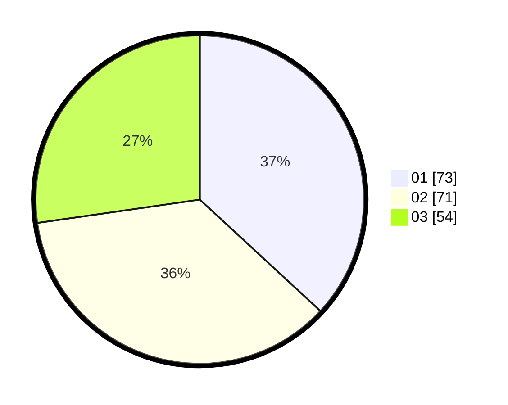

# Hasil

Hasil perolehan suara paslon dapat dilihat pada file paslon-01.txt, paslon-02.txt, dan paslon-03.txt.

Jika tidak ada, artinya data tersebut belum ada pada SIREKAP.

## Perolehan Suara

 * Paslon 01: **73**.
 * Paslon 02: **71**.
 * Paslon 03: **54**.

## Foto C Plano

https://sirekap-obj-formc.kpu.go.id/05a6/pemilu/ppwp/31/73/04/10/06/3173041006071-20240214-221807--1406048c-06f0-4518-9f6e-82da5146f9d1.jpg

https://sirekap-obj-formc.kpu.go.id/05a6/pemilu/ppwp/31/73/04/10/06/3173041006071-20240214-221906--24c9de9d-9003-41f6-90a1-8919aebdac40.jpg

https://sirekap-obj-formc.kpu.go.id/05a6/pemilu/ppwp/31/73/04/10/06/3173041006071-20240214-221950--f6c77327-e4fc-4947-ab22-2ed7131c1ab9.jpg
