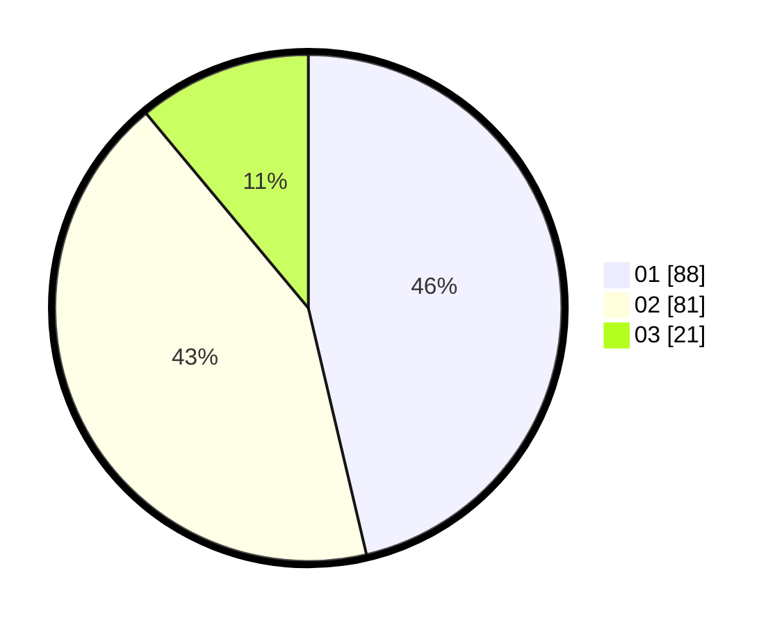

# Hasil

Hasil perolehan suara paslon dapat dilihat pada file paslon-01.txt, paslon-02.txt, dan paslon-03.txt.

Jika tidak ada, artinya data tersebut belum ada pada SIREKAP.

## Perolehan Suara

 * Paslon 01: **88**.
 * Paslon 02: **81**.
 * Paslon 03: **21**.

## Foto C Plano

https://sirekap-obj-formc.kpu.go.id/dae5/pemilu/ppwp/31/73/04/10/06/3173041006074-20240214-220336--b8c3122f-2ebe-4a13-a9ac-91f422b6002f.jpg

https://sirekap-obj-formc.kpu.go.id/dae5/pemilu/ppwp/31/73/04/10/06/3173041006074-20240214-214012--2550ec41-0d04-42b5-9af1-3fdacde5e20b.jpg

https://sirekap-obj-formc.kpu.go.id/dae5/pemilu/ppwp/31/73/04/10/06/3173041006074-20240214-211625--0e93ecb1-d836-4d45-ae16-8b4b53a44c62.jpg
