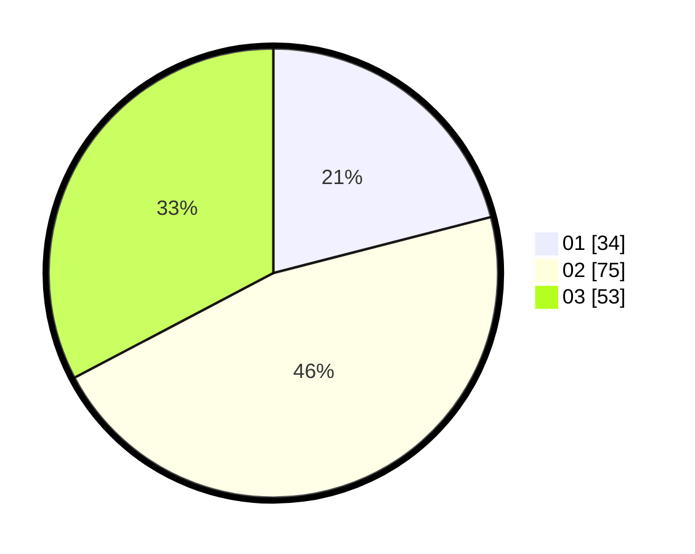

# Hasil

Hasil perolehan suara paslon dapat dilihat pada file paslon-01.txt, paslon-02.txt, dan paslon-03.txt.

Jika tidak ada, artinya data tersebut belum ada pada SIREKAP.

## Perolehan Suara

 * Paslon 01: **34**.
 * Paslon 02: **75**.
 * Paslon 03: **53**.

## Foto C Plano

https://sirekap-obj-formc.kpu.go.id/8eed/pemilu/ppwp/31/73/04/10/06/3173041006078-20240214-204059--13f4443d-5573-4c24-8a6e-1f7a2128fbd8.jpg

https://sirekap-obj-formc.kpu.go.id/8eed/pemilu/ppwp/31/73/04/10/06/3173041006078-20240214-204248--cddff332-9560-46d8-a4c6-7b2627442366.jpg

https://sirekap-obj-formc.kpu.go.id/8eed/pemilu/ppwp/31/73/04/10/06/3173041006078-20240214-204352--01937b23-3365-44da-b5cd-404d178e8405.jpg
