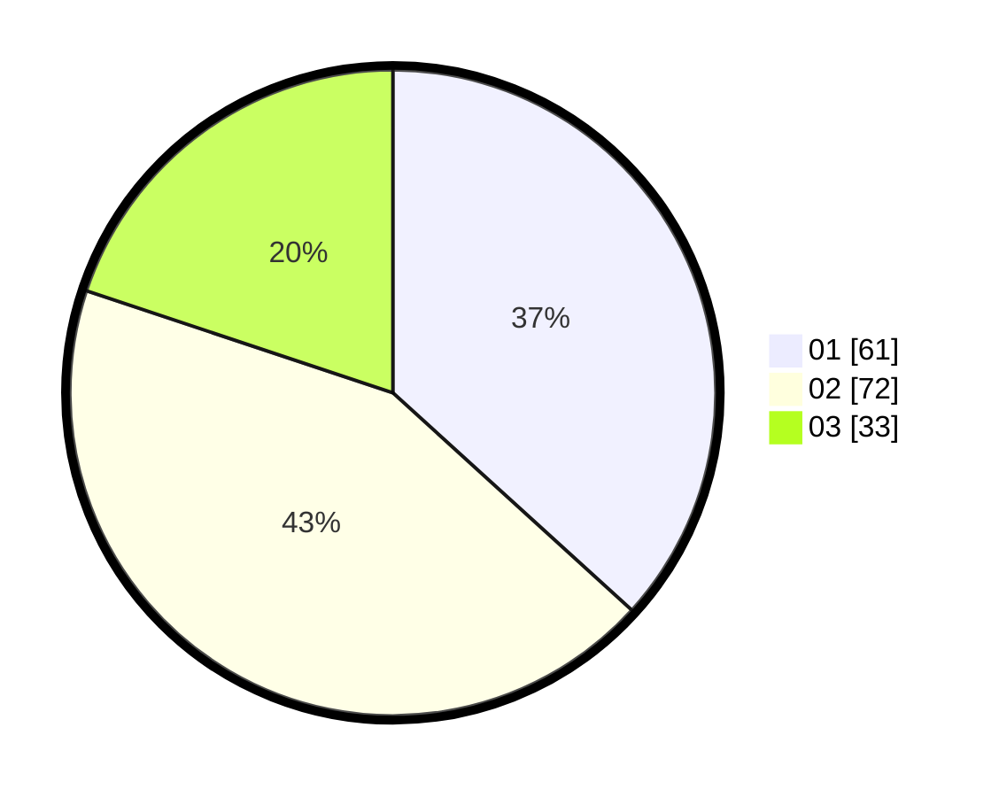

# Hasil

Hasil perolehan suara paslon dapat dilihat pada file paslon-01.txt, paslon-02.txt, dan paslon-03.txt.

Jika tidak ada, artinya data tersebut belum ada pada SIREKAP.

## Perolehan Suara

 * Paslon 01: **61**.
 * Paslon 02: **72**.
 * Paslon 03: **33**.

## Foto C Plano

https://sirekap-obj-formc.kpu.go.id/f1f1/pemilu/ppwp/31/73/04/10/06/3173041006080-20240214-160154--677851ea-7172-4597-9ffa-b0b1d885cf14.jpg

https://sirekap-obj-formc.kpu.go.id/f1f1/pemilu/ppwp/31/73/04/10/06/3173041006080-20240214-224401--29a95889-f4e8-4d00-b88c-57d6676151a4.jpg

https://sirekap-obj-formc.kpu.go.id/f1f1/pemilu/ppwp/31/73/04/10/06/3173041006080-20240214-194222--ba38f219-e12f-4f69-8643-c42ad1c09bde.jpg

## DATA PEMILIH TETAP

Jumlah pemilih dalam DPT: **170**.
 * L: **91**.
 * P: **79**.

## DATA PENGGUNA HAK PILIH

Jumlah pengguna hak pilih dalam DPT: **169**.
 * L: **91**.
 * P: **78**.

Jumlah pengguna hak pilih dalam DPTb: **1**.
 * L: **0**.
 * P: **1**.

Jumlah pengguna hak pilih dalam DPK: **0**.
 * L: **0**.
 * P: **0**.

Jumlah pengguna hak pilih: **170**.
 * L: **91**.
 * P: **79**.

## JUMLAH SUARA SAH DAN TIDAK SAH

JUMLAH SELURUH SUARA SAH: **166**.

JUMLAH SUARA TIDAK SAH: **4**.

JUMLAH SELURUH SUARA SAH DAN SUARA TIDAK SAH: **170**.
