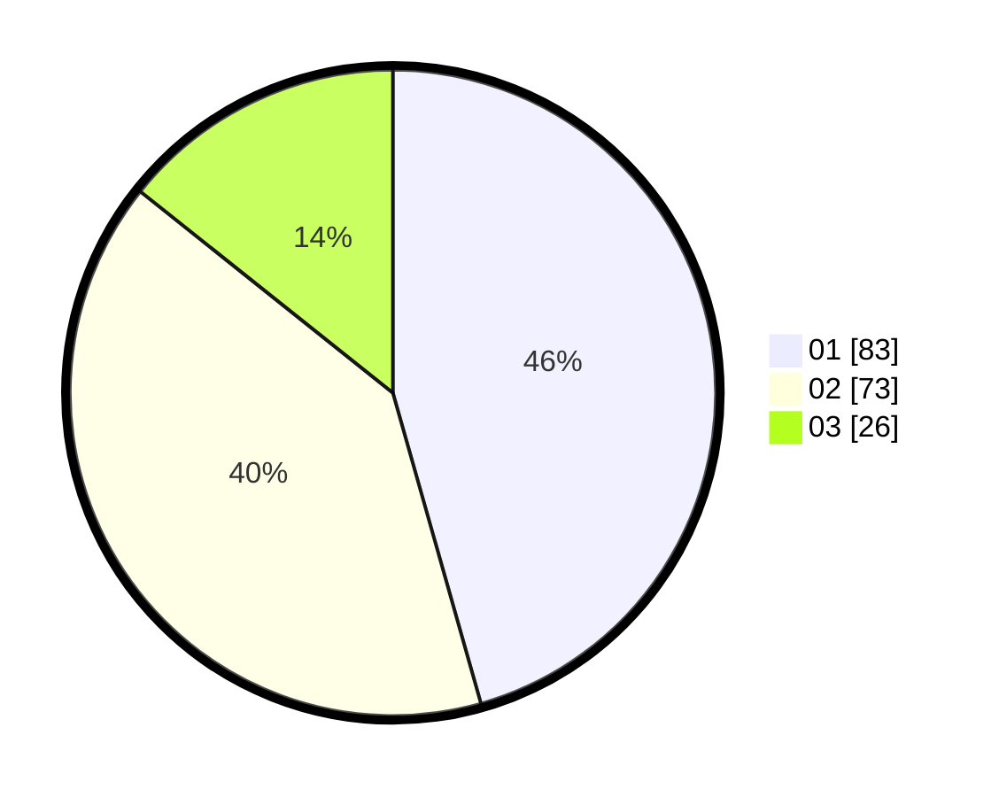

# Hasil

Hasil perolehan suara paslon dapat dilihat pada file paslon-01.txt, paslon-02.txt, dan paslon-03.txt.

Jika tidak ada, artinya data tersebut belum ada pada SIREKAP.

## Perolehan Suara

 * Paslon 01: **83**.
 * Paslon 02: **73**.
 * Paslon 03: **26**.

## Foto C Plano

https://sirekap-obj-formc.kpu.go.id/153f/pemilu/ppwp/31/73/04/10/06/3173041006082-20240215-023314--c053dd06-c35e-4563-861c-66377cc34328.jpg

https://sirekap-obj-formc.kpu.go.id/153f/pemilu/ppwp/31/73/04/10/06/3173041006082-20240215-023908--536f8982-4170-4251-9431-dc571dd2c6a5.jpg

https://sirekap-obj-formc.kpu.go.id/153f/pemilu/ppwp/31/73/04/10/06/3173041006082-20240215-023658--f4b04e4b-7fd9-4fc1-b3ed-38c1b02796bf.jpg
