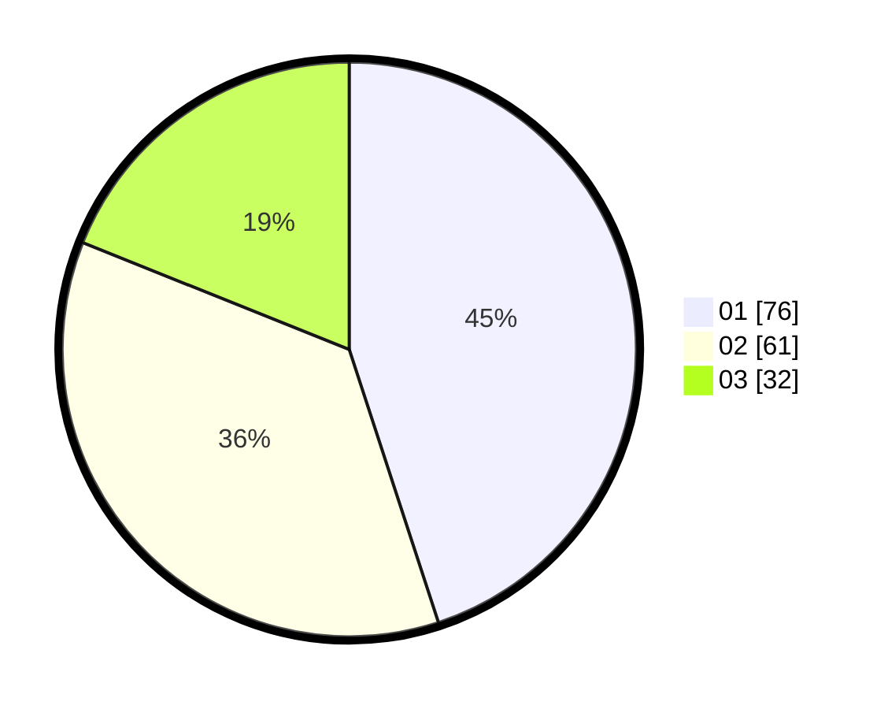

# Hasil

Hasil perolehan suara paslon dapat dilihat pada file paslon-01.txt, paslon-02.txt, dan paslon-03.txt.

Jika tidak ada, artinya data tersebut belum ada pada SIREKAP.

## Perolehan Suara

 * Paslon 01: **76**.
 * Paslon 02: **61**.
 * Paslon 03: **32**.

## Foto C Plano

https://sirekap-obj-formc.kpu.go.id/0cde/pemilu/ppwp/31/73/04/10/06/3173041006084-20240214-234513--17067968-24e8-455f-bfbd-4f07e61ab00f.jpg

https://sirekap-obj-formc.kpu.go.id/0cde/pemilu/ppwp/31/73/04/10/06/3173041006084-20240214-234634--8a282d4d-46b4-4a7f-bc5e-a3d4e85a4893.jpg

https://sirekap-obj-formc.kpu.go.id/0cde/pemilu/ppwp/31/73/04/10/06/3173041006084-20240214-234806--0b366ada-ab44-49b4-9ca5-aae068042f24.jpg
