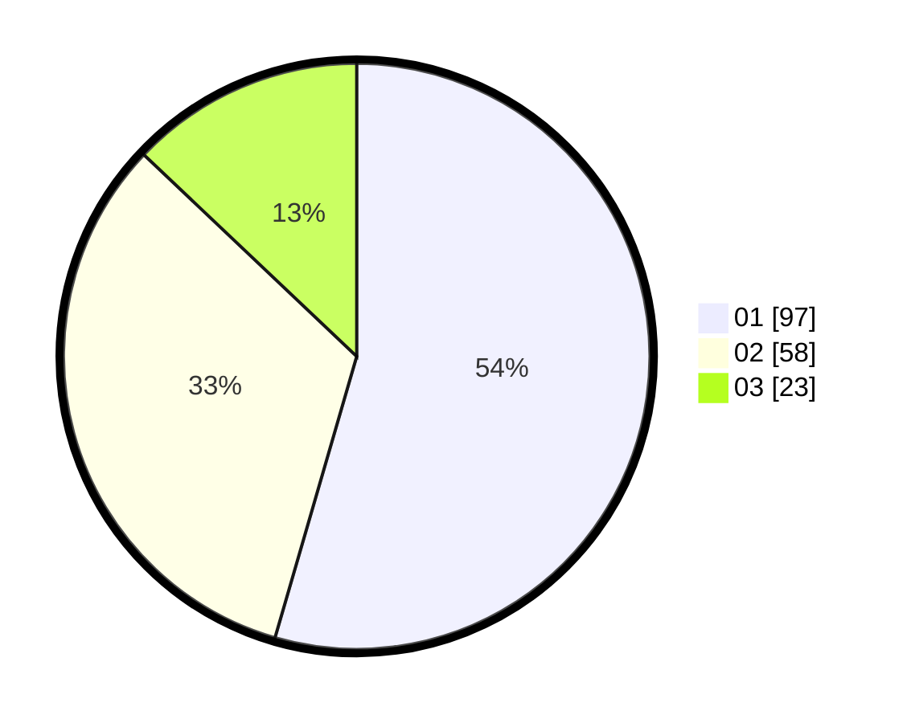

# Hasil

Hasil perolehan suara paslon dapat dilihat pada file paslon-01.txt, paslon-02.txt, dan paslon-03.txt.

Jika tidak ada, artinya data tersebut belum ada pada SIREKAP.

## Perolehan Suara

 * Paslon 01: **97**.
 * Paslon 02: **58**.
 * Paslon 03: **23**.

## Foto C Plano

https://sirekap-obj-formc.kpu.go.id/e0d5/pemilu/ppwp/31/73/04/10/06/3173041006091-20240214-210714--f2c854f5-f6ef-4e47-91c7-70f1000d8e92.jpg

https://sirekap-obj-formc.kpu.go.id/e0d5/pemilu/ppwp/31/73/04/10/06/3173041006091-20240214-210904--f7967ce6-2ecb-4cd1-9a40-23c6aa8716af.jpg

https://sirekap-obj-formc.kpu.go.id/e0d5/pemilu/ppwp/31/73/04/10/06/3173041006091-20240214-211011--b62ff2ff-8920-4951-bd0d-afcf95c714bc.jpg
