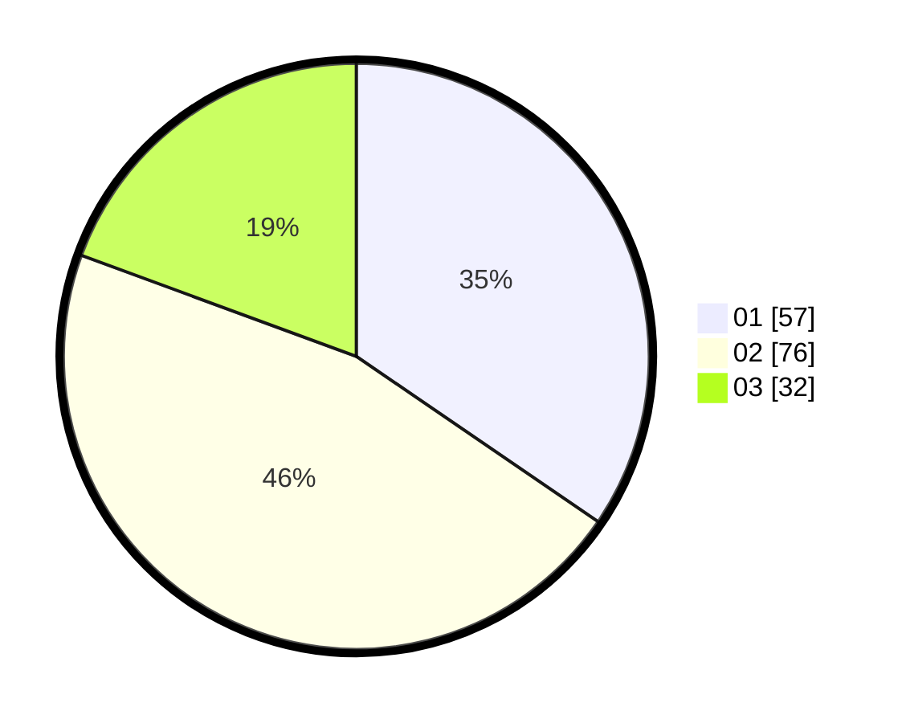

# Hasil

Hasil perolehan suara paslon dapat dilihat pada file paslon-01.txt, paslon-02.txt, dan paslon-03.txt.

Jika tidak ada, artinya data tersebut belum ada pada SIREKAP.

## Perolehan Suara

 * Paslon 01: **57**.
 * Paslon 02: **76**.
 * Paslon 03: **32**.

## Foto C Plano

https://sirekap-obj-formc.kpu.go.id/bf5d/pemilu/ppwp/31/73/04/10/06/3173041006094-20240216-142217--79fab7d8-5e4f-4114-abb6-a3a94347849c.jpg

https://sirekap-obj-formc.kpu.go.id/bf5d/pemilu/ppwp/31/73/04/10/06/3173041006094-20240216-142218--8bd4b924-1a10-4a94-a44b-590107964a62.jpg

https://sirekap-obj-formc.kpu.go.id/bf5d/pemilu/ppwp/31/73/04/10/06/3173041006094-20240216-142218--9762beaa-865a-43f5-a177-2396a7f4cd5f.jpg

## DATA PEMILIH TETAP

Jumlah pemilih dalam DPT: **262**.
 * L: **131**.
 * P: **131**.

## DATA PENGGUNA HAK PILIH

Jumlah pengguna hak pilih dalam DPT: **165**.
 * L: **81**.
 * P: **84**.

Jumlah pengguna hak pilih dalam DPTb: **0**.
 * L: **0**.
 * P: **0**.

Jumlah pengguna hak pilih dalam DPK: **0**.
 * L: **0**.
 * P: **0**.

Jumlah pengguna hak pilih: **165**.
 * L: **81**.
 * P: **84**.

## JUMLAH SUARA SAH DAN TIDAK SAH

JUMLAH SELURUH SUARA SAH: **165**.

JUMLAH SUARA TIDAK SAH: **0**.

JUMLAH SELURUH SUARA SAH DAN SUARA TIDAK SAH: **165**.
