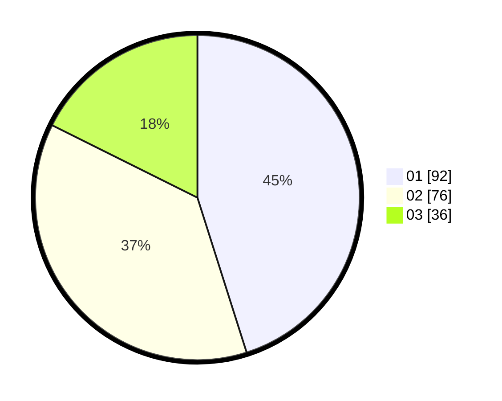

# Hasil

Hasil perolehan suara paslon dapat dilihat pada file paslon-01.txt, paslon-02.txt, dan paslon-03.txt.

Jika tidak ada, artinya data tersebut belum ada pada SIREKAP.

## Perolehan Suara

 * Paslon 01: **92**.
 * Paslon 02: **76**.
 * Paslon 03: **36**.

## Foto C Plano

https://sirekap-obj-formc.kpu.go.id/3314/pemilu/ppwp/31/73/04/10/06/3173041006095-20240215-003022--b8f43234-fb8d-415a-852c-b442b7d0099d.jpg

https://sirekap-obj-formc.kpu.go.id/3314/pemilu/ppwp/31/73/04/10/06/3173041006095-20240215-002916--421aaf98-ef67-4012-9f1a-fbafc50df0e0.jpg

https://sirekap-obj-formc.kpu.go.id/3314/pemilu/ppwp/31/73/04/10/06/3173041006095-20240215-003354--31027604-27c3-43c3-a2d9-22ec6a878ec4.jpg
