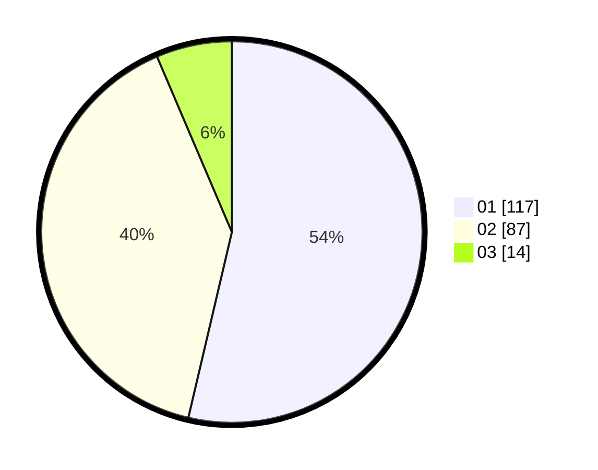

# Hasil

Hasil perolehan suara paslon dapat dilihat pada file paslon-01.txt, paslon-02.txt, dan paslon-03.txt.

Jika tidak ada, artinya data tersebut belum ada pada SIREKAP.

## Perolehan Suara

 * Paslon 01: **117**.
 * Paslon 02: **87**.
 * Paslon 03: **14**.

## Foto C Plano

https://sirekap-obj-formc.kpu.go.id/369a/pemilu/ppwp/31/73/04/10/06/3173041006096-20240214-212401--9750391a-5de3-4db7-b224-4758208fb333.jpg

https://sirekap-obj-formc.kpu.go.id/369a/pemilu/ppwp/31/73/04/10/06/3173041006096-20240214-212811--e2ac5878-fa67-4022-b247-feda0faf19b1.jpg

https://sirekap-obj-formc.kpu.go.id/369a/pemilu/ppwp/31/73/04/10/06/3173041006096-20240214-212901--1fc10cb5-f74d-4cec-8725-6d85486f9642.jpg
