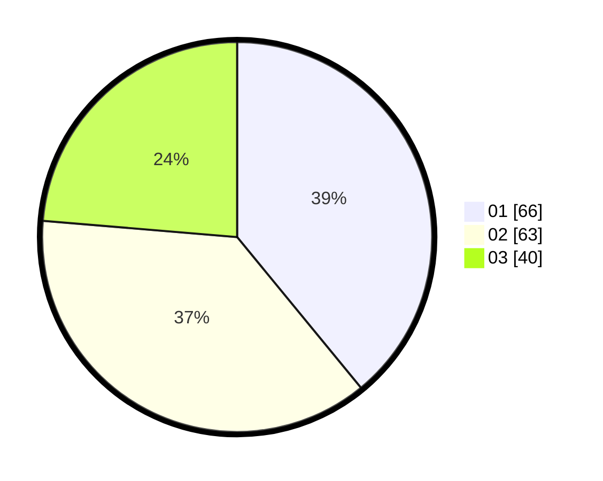

# Hasil

Hasil perolehan suara paslon dapat dilihat pada file paslon-01.txt, paslon-02.txt, dan paslon-03.txt.

Jika tidak ada, artinya data tersebut belum ada pada SIREKAP.

## Perolehan Suara

 * Paslon 01: **66**.
 * Paslon 02: **63**.
 * Paslon 03: **40**.

## Foto C Plano

https://sirekap-obj-formc.kpu.go.id/a916/pemilu/ppwp/31/73/04/10/06/3173041006098-20240214-160148--b00a7c9c-6c72-4d5a-a63b-4311478f2eb2.jpg

https://sirekap-obj-formc.kpu.go.id/a916/pemilu/ppwp/31/73/04/10/06/3173041006098-20240214-155648--1ea91d22-c9a3-4be8-bc10-49c7b8cbbe7f.jpg

https://sirekap-obj-formc.kpu.go.id/a916/pemilu/ppwp/31/73/04/10/06/3173041006098-20240214-155747--1e6654d2-5402-44ea-91fa-d4c298bae66a.jpg
