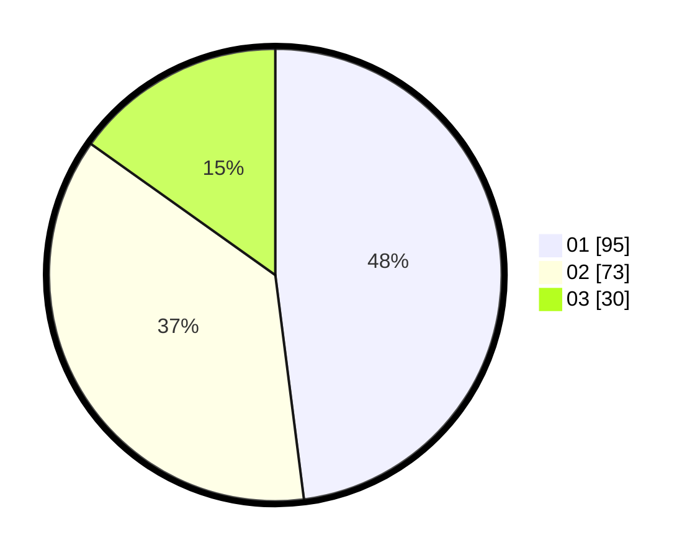

# Hasil

Hasil perolehan suara paslon dapat dilihat pada file paslon-01.txt, paslon-02.txt, dan paslon-03.txt.

Jika tidak ada, artinya data tersebut belum ada pada SIREKAP.

## Perolehan Suara

 * Paslon 01: **95**.
 * Paslon 02: **73**.
 * Paslon 03: **30**.

## Foto C Plano

https://sirekap-obj-formc.kpu.go.id/c74f/pemilu/ppwp/31/73/04/10/06/3173041006099-20240214-233723--3c33f338-2702-4690-8416-98adf5ba5c45.jpg

https://sirekap-obj-formc.kpu.go.id/c74f/pemilu/ppwp/31/73/04/10/06/3173041006099-20240214-234005--3104acd5-8c13-4e10-a926-68979d7131c1.jpg

https://sirekap-obj-formc.kpu.go.id/c74f/pemilu/ppwp/31/73/04/10/06/3173041006099-20240214-231348--1974a4f5-1e59-4fd9-8b92-6b0a108087b5.jpg
