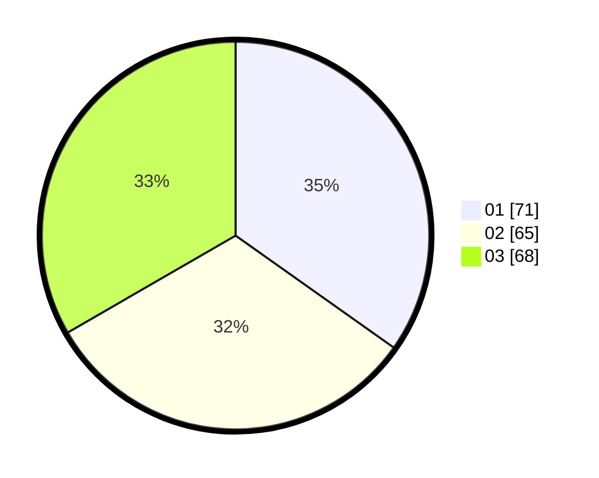

# Hasil

Hasil perolehan suara paslon dapat dilihat pada file paslon-01.txt, paslon-02.txt, dan paslon-03.txt.

Jika tidak ada, artinya data tersebut belum ada pada SIREKAP.

## Perolehan Suara

 * Paslon 01: **71**.
 * Paslon 02: **65**.
 * Paslon 03: **68**.

## Foto C Plano

https://sirekap-obj-formc.kpu.go.id/e9a6/pemilu/ppwp/31/73/04/10/06/3173041006100-20240215-010231--a22bd713-72ee-423c-b532-5849f418f8b5.jpg

https://sirekap-obj-formc.kpu.go.id/e9a6/pemilu/ppwp/31/73/04/10/06/3173041006100-20240215-010338--5cd867aa-2e92-495e-a1ee-ba3f53c83449.jpg

https://sirekap-obj-formc.kpu.go.id/e9a6/pemilu/ppwp/31/73/04/10/06/3173041006100-20240215-010626--4203f758-3afd-4eeb-860a-a2af464f1134.jpg
