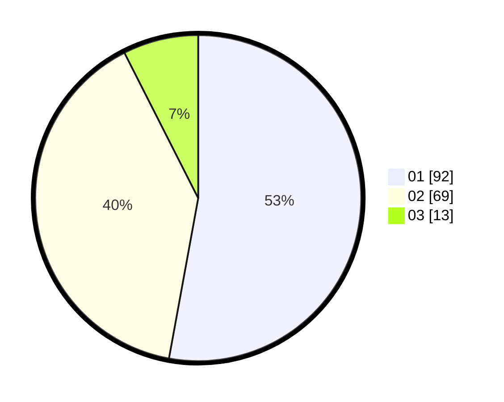

# Hasil

Hasil perolehan suara paslon dapat dilihat pada file paslon-01.txt, paslon-02.txt, dan paslon-03.txt.

Jika tidak ada, artinya data tersebut belum ada pada SIREKAP.

## Perolehan Suara

 * Paslon 01: **92**.
 * Paslon 02: **69**.
 * Paslon 03: **13**.

## Foto C Plano

https://sirekap-obj-formc.kpu.go.id/55dd/pemilu/ppwp/31/73/04/10/07/3173041007004-20240216-011550--ef455f9d-0d60-4d0d-b7cd-0923aef4e3cd.jpg

https://sirekap-obj-formc.kpu.go.id/55dd/pemilu/ppwp/31/73/04/10/07/3173041007004-20240216-013215--a15b944d-a3c2-4d8a-a81d-45148ca79002.jpg

https://sirekap-obj-formc.kpu.go.id/55dd/pemilu/ppwp/31/73/04/10/07/3173041007004-20240216-011559--2e478dac-bec9-4f64-97c8-7d823f8b3b0e.jpg

## DATA PEMILIH TETAP

Jumlah pemilih dalam DPT: **0**.
 * L: **0**.
 * P: **0**.

## DATA PENGGUNA HAK PILIH

Jumlah pengguna hak pilih dalam DPT: **0**.
 * L: **0**.
 * P: **0**.

Jumlah pengguna hak pilih dalam DPTb: **0**.
 * L: **0**.
 * P: **0**.

Jumlah pengguna hak pilih dalam DPK: **0**.
 * L: **0**.
 * P: **0**.

Jumlah pengguna hak pilih: **0**.
 * L: **0**.
 * P: **0**.

## JUMLAH SUARA SAH DAN TIDAK SAH

JUMLAH SELURUH SUARA SAH: **174**.

JUMLAH SUARA TIDAK SAH: **5**.

JUMLAH SELURUH SUARA SAH DAN SUARA TIDAK SAH: **179**.
