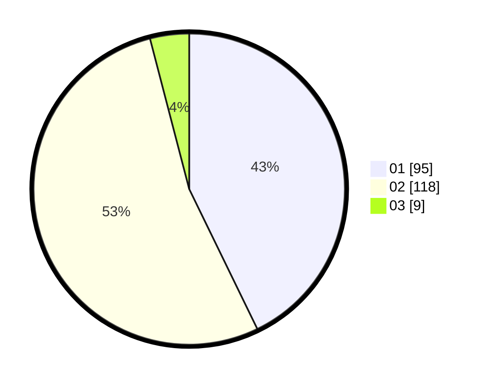

# Hasil

Hasil perolehan suara paslon dapat dilihat pada file paslon-01.txt, paslon-02.txt, dan paslon-03.txt.

Jika tidak ada, artinya data tersebut belum ada pada SIREKAP.

## Perolehan Suara

 * Paslon 01: **95**.
 * Paslon 02: **118**.
 * Paslon 03: **9**.

## Foto C Plano

https://sirekap-obj-formc.kpu.go.id/7311/pemilu/ppwp/31/73/04/10/07/3173041007005-20240215-181316--7d04b803-1f43-4b8c-a2e0-cd37bd3bf695.jpg

https://sirekap-obj-formc.kpu.go.id/7311/pemilu/ppwp/31/73/04/10/07/3173041007005-20240215-181456--6d756684-62eb-43ed-9a02-b0c1e3a5e940.jpg

https://sirekap-obj-formc.kpu.go.id/7311/pemilu/ppwp/31/73/04/10/07/3173041007005-20240215-181612--046c0ccb-434a-48fb-a0a9-8d2e492de96d.jpg
