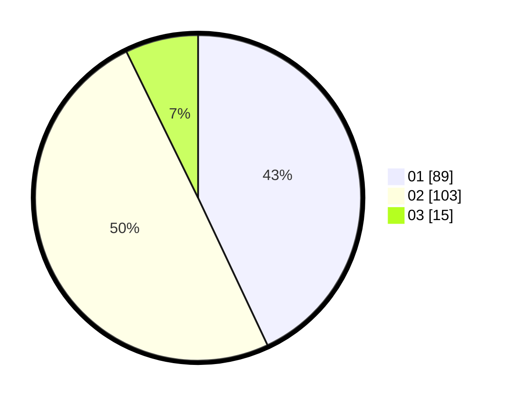

# Hasil

Hasil perolehan suara paslon dapat dilihat pada file paslon-01.txt, paslon-02.txt, dan paslon-03.txt.

Jika tidak ada, artinya data tersebut belum ada pada SIREKAP.

## Perolehan Suara

 * Paslon 01: **89**.
 * Paslon 02: **103**.
 * Paslon 03: **15**.

## Foto C Plano

https://sirekap-obj-formc.kpu.go.id/3b8b/pemilu/ppwp/31/73/04/10/07/3173041007006-20240214-231017--135512c0-ea83-4b1d-814d-c346578d3487.jpg

https://sirekap-obj-formc.kpu.go.id/3b8b/pemilu/ppwp/31/73/04/10/07/3173041007006-20240214-231613--ce874577-8e6f-4e5c-b1e3-bf16bf4171dd.jpg

https://sirekap-obj-formc.kpu.go.id/3b8b/pemilu/ppwp/31/73/04/10/07/3173041007006-20240214-231728--f93735ff-27a6-42a0-babe-f4517a05a01b.jpg
