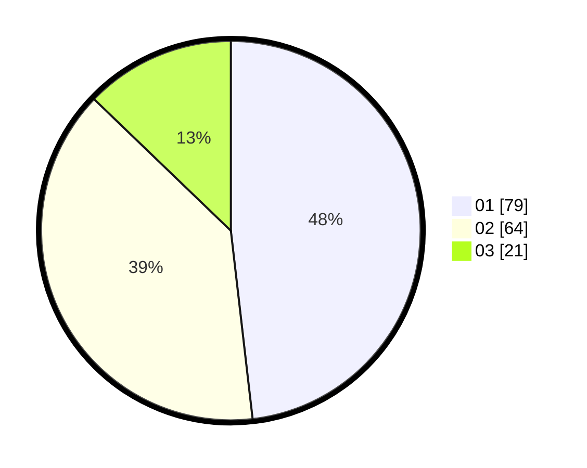

# Hasil

Hasil perolehan suara paslon dapat dilihat pada file paslon-01.txt, paslon-02.txt, dan paslon-03.txt.

Jika tidak ada, artinya data tersebut belum ada pada SIREKAP.

## Perolehan Suara

 * Paslon 01: **79**.
 * Paslon 02: **64**.
 * Paslon 03: **21**.

## Foto C Plano

https://sirekap-obj-formc.kpu.go.id/fb0e/pemilu/ppwp/31/73/04/10/07/3173041007007-20240214-155321--d208389d-8d09-4ce5-8fb0-5835ad5af47c.jpg

https://sirekap-obj-formc.kpu.go.id/fb0e/pemilu/ppwp/31/73/04/10/07/3173041007007-20240214-155208--40476d23-1895-4b1a-a93d-efb43593e478.jpg

https://sirekap-obj-formc.kpu.go.id/fb0e/pemilu/ppwp/31/73/04/10/07/3173041007007-20240214-155401--b1a0737d-2787-450c-ae31-7e5cd64eff89.jpg

## DATA PEMILIH TETAP

Jumlah pemilih dalam DPT: **234**.
 * L: **124**.
 * P: **110**.

## DATA PENGGUNA HAK PILIH

Jumlah pengguna hak pilih dalam DPT: **166**.
 * L: **87**.
 * P: **79**.

Jumlah pengguna hak pilih dalam DPTb: **0**.
 * L: **0**.
 * P: **0**.

Jumlah pengguna hak pilih dalam DPK: **0**.
 * L: **0**.
 * P: **0**.

Jumlah pengguna hak pilih: **166**.
 * L: **87**.
 * P: **79**.

## JUMLAH SUARA SAH DAN TIDAK SAH

JUMLAH SELURUH SUARA SAH: **164**.

JUMLAH SUARA TIDAK SAH: **2**.

JUMLAH SELURUH SUARA SAH DAN SUARA TIDAK SAH: **166**.
