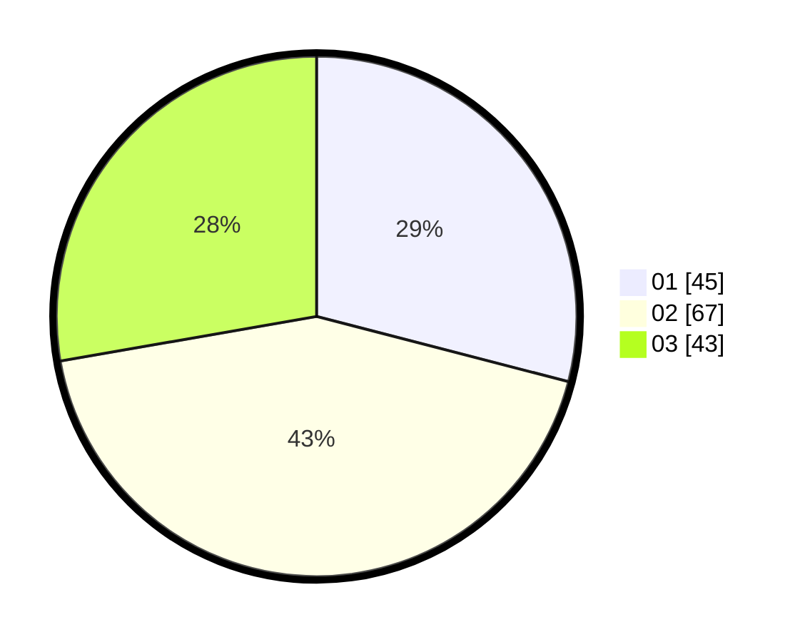

# Hasil

Hasil perolehan suara paslon dapat dilihat pada file paslon-01.txt, paslon-02.txt, dan paslon-03.txt.

Jika tidak ada, artinya data tersebut belum ada pada SIREKAP.

## Perolehan Suara

 * Paslon 01: **45**.
 * Paslon 02: **67**.
 * Paslon 03: **43**.

## Foto C Plano

https://sirekap-obj-formc.kpu.go.id/9295/pemilu/ppwp/31/73/04/10/07/3173041007011-20240214-155050--861c00ab-c402-4d34-979f-41f7666998cb.jpg

https://sirekap-obj-formc.kpu.go.id/9295/pemilu/ppwp/31/73/04/10/07/3173041007011-20240215-000838--2692a735-a623-43e7-9f10-9d05844c8b5b.jpg

https://sirekap-obj-formc.kpu.go.id/9295/pemilu/ppwp/31/73/04/10/07/3173041007011-20240214-224111--cbbee10e-5d12-4fbd-ac3d-7ded2d4bc281.jpg
