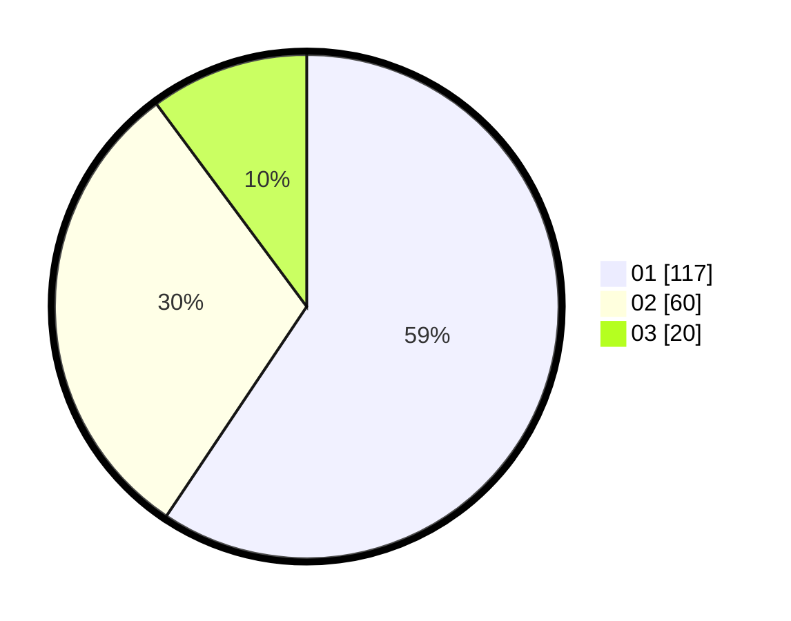

# Hasil

Hasil perolehan suara paslon dapat dilihat pada file paslon-01.txt, paslon-02.txt, dan paslon-03.txt.

Jika tidak ada, artinya data tersebut belum ada pada SIREKAP.

## Perolehan Suara

 * Paslon 01: **117**.
 * Paslon 02: **60**.
 * Paslon 03: **20**.

## Foto C Plano

https://sirekap-obj-formc.kpu.go.id/6b0f/pemilu/ppwp/31/73/04/10/07/3173041007012-20240214-235954--f134b140-fb44-4db0-a05d-260628180368.jpg

https://sirekap-obj-formc.kpu.go.id/6b0f/pemilu/ppwp/31/73/04/10/07/3173041007012-20240214-235323--720bddf2-d348-46b9-9b50-8275c6daa168.jpg

https://sirekap-obj-formc.kpu.go.id/6b0f/pemilu/ppwp/31/73/04/10/07/3173041007012-20240214-235813--e038e666-159b-470a-9fc6-eb666748a0f3.jpg

## DATA PEMILIH TETAP

Jumlah pemilih dalam DPT: **271**.
 * L: **141**.
 * P: **130**.

## DATA PENGGUNA HAK PILIH

Jumlah pengguna hak pilih dalam DPT: **197**.
 * L: **102**.
 * P: **95**.

Jumlah pengguna hak pilih dalam DPTb: **1**.
 * L: **1**.
 * P: **0**.

Jumlah pengguna hak pilih dalam DPK: **0**.
 * L: **0**.
 * P: **0**.

Jumlah pengguna hak pilih: **198**.
 * L: **103**.
 * P: **95**.

## JUMLAH SUARA SAH DAN TIDAK SAH

JUMLAH SELURUH SUARA SAH: **197**.

JUMLAH SUARA TIDAK SAH: **1**.

JUMLAH SELURUH SUARA SAH DAN SUARA TIDAK SAH: **198**.
