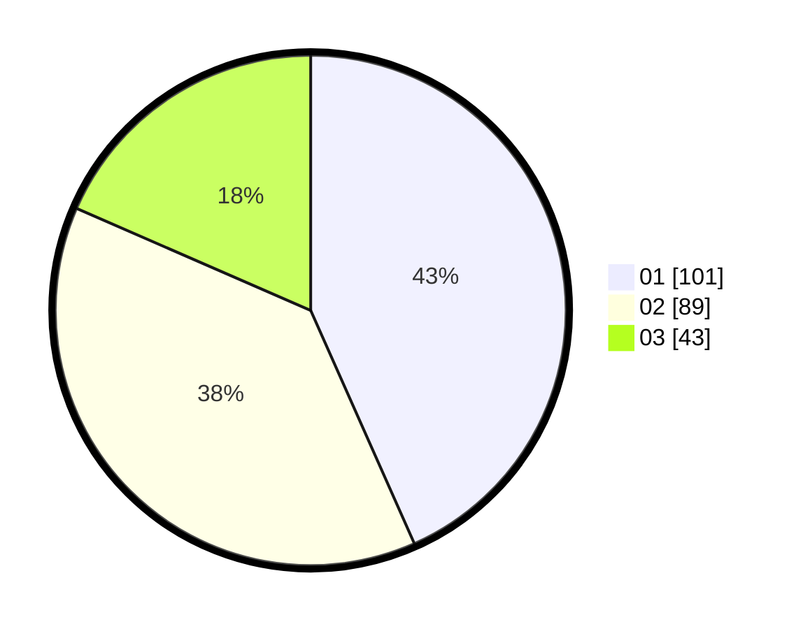

# Hasil

Hasil perolehan suara paslon dapat dilihat pada file paslon-01.txt, paslon-02.txt, dan paslon-03.txt.

Jika tidak ada, artinya data tersebut belum ada pada SIREKAP.

## Perolehan Suara

 * Paslon 01: **101**.
 * Paslon 02: **89**.
 * Paslon 03: **43**.

## Foto C Plano

https://sirekap-obj-formc.kpu.go.id/aa55/pemilu/ppwp/31/73/04/10/07/3173041007013-20240215-005001--ca0f3b4b-fb0c-4cb5-9b7c-eb98e42585da.jpg

https://sirekap-obj-formc.kpu.go.id/aa55/pemilu/ppwp/31/73/04/10/07/3173041007013-20240215-005133--1fa6773e-22c8-4d00-b971-f810d2eae8bb.jpg

https://sirekap-obj-formc.kpu.go.id/aa55/pemilu/ppwp/31/73/04/10/07/3173041007013-20240215-005413--f3eff0c0-92eb-441e-a3db-438d95d58eab.jpg
