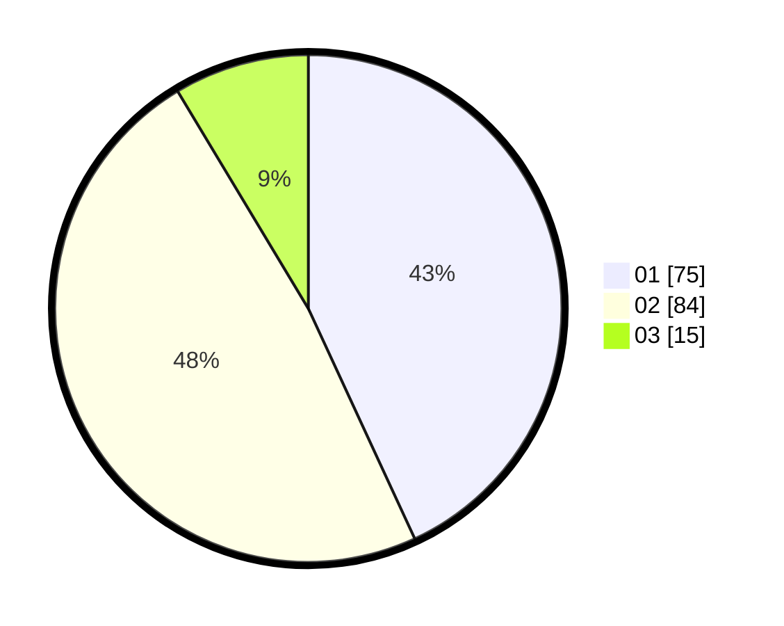

# Hasil

Hasil perolehan suara paslon dapat dilihat pada file paslon-01.txt, paslon-02.txt, dan paslon-03.txt.

Jika tidak ada, artinya data tersebut belum ada pada SIREKAP.

## Perolehan Suara

 * Paslon 01: **75**.
 * Paslon 02: **84**.
 * Paslon 03: **15**.

## Foto C Plano

https://sirekap-obj-formc.kpu.go.id/a8aa/pemilu/ppwp/31/73/04/10/07/3173041007018-20240215-015026--b79c4cdb-f840-411b-9c71-5d74f481efda.jpg

https://sirekap-obj-formc.kpu.go.id/a8aa/pemilu/ppwp/31/73/04/10/07/3173041007018-20240215-015200--aa7ae007-41b3-4222-af49-27231ba59edc.jpg

https://sirekap-obj-formc.kpu.go.id/a8aa/pemilu/ppwp/31/73/04/10/07/3173041007018-20240215-020818--fdeae899-df08-4f6b-8c4a-77ae15bfa5af.jpg
