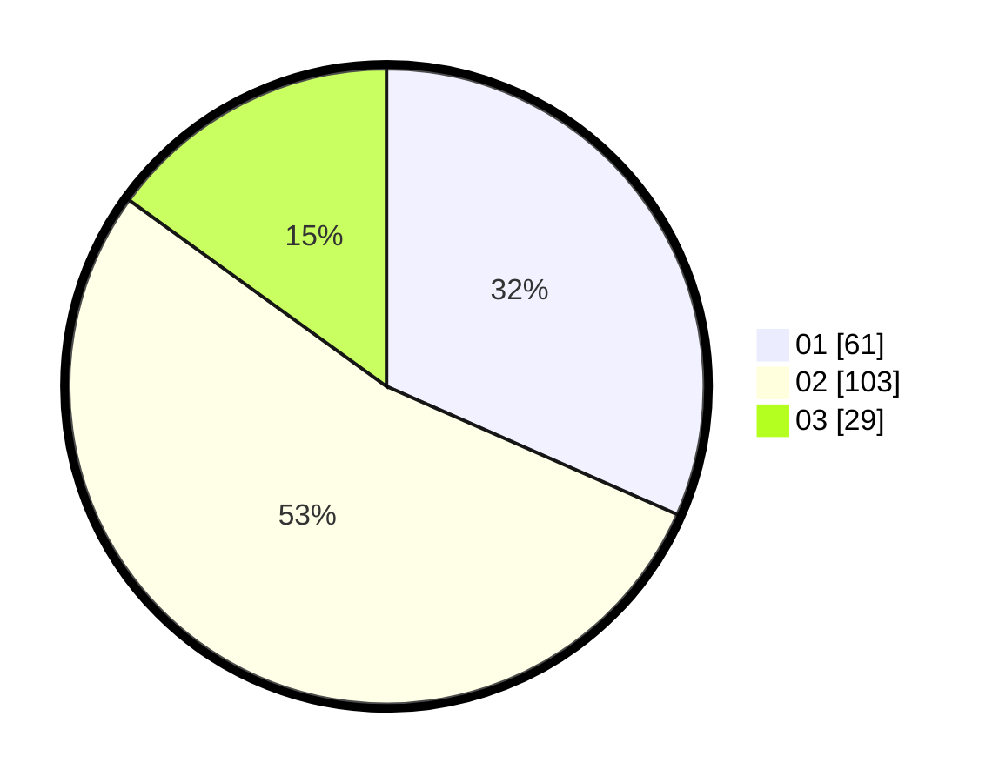

# Hasil

Hasil perolehan suara paslon dapat dilihat pada file paslon-01.txt, paslon-02.txt, dan paslon-03.txt.

Jika tidak ada, artinya data tersebut belum ada pada SIREKAP.

## Perolehan Suara

 * Paslon 01: **61**.
 * Paslon 02: **103**.
 * Paslon 03: **29**.

## Foto C Plano

https://sirekap-obj-formc.kpu.go.id/e669/pemilu/ppwp/31/73/04/10/07/3173041007019-20240214-203707--ade4f2b4-b601-41cf-8083-f7a11b2d95f0.jpg

https://sirekap-obj-formc.kpu.go.id/e669/pemilu/ppwp/31/73/04/10/07/3173041007019-20240214-203821--62ac93f2-5210-4a09-bbd8-28203a06b2f4.jpg

https://sirekap-obj-formc.kpu.go.id/e669/pemilu/ppwp/31/73/04/10/07/3173041007019-20240214-203931--685dec40-3014-458a-ad08-1c0b6cfffe88.jpg

## DATA PEMILIH TETAP

Jumlah pemilih dalam DPT: **275**.
 * L: **141**.
 * P: **134**.

## DATA PENGGUNA HAK PILIH

Jumlah pengguna hak pilih dalam DPT: **192**.
 * L: **99**.
 * P: **93**.

Jumlah pengguna hak pilih dalam DPTb: **2**.
 * L: **1**.
 * P: **1**.

Jumlah pengguna hak pilih dalam DPK: **0**.
 * L: **0**.
 * P: **0**.

Jumlah pengguna hak pilih: **194**.
 * L: **100**.
 * P: **94**.

## JUMLAH SUARA SAH DAN TIDAK SAH

JUMLAH SELURUH SUARA SAH: **193**.

JUMLAH SUARA TIDAK SAH: **1**.

JUMLAH SELURUH SUARA SAH DAN SUARA TIDAK SAH: **194**.
