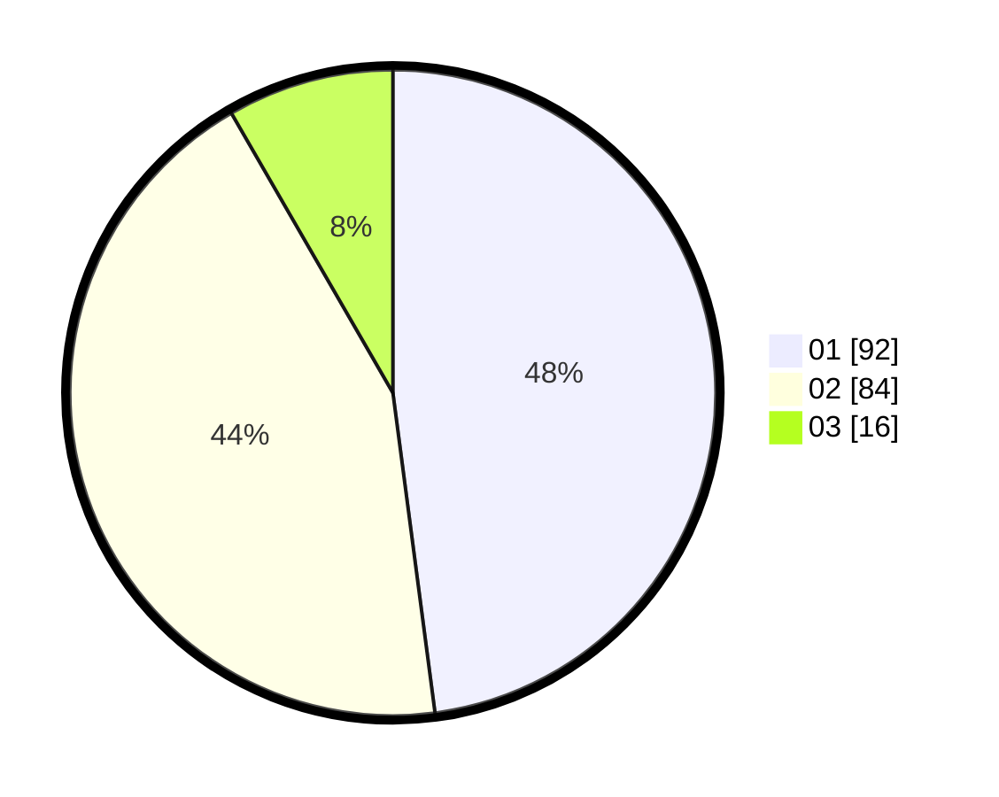

# Hasil

Hasil perolehan suara paslon dapat dilihat pada file paslon-01.txt, paslon-02.txt, dan paslon-03.txt.

Jika tidak ada, artinya data tersebut belum ada pada SIREKAP.

## Perolehan Suara

 * Paslon 01: **92**.
 * Paslon 02: **84**.
 * Paslon 03: **16**.

## Foto C Plano

https://sirekap-obj-formc.kpu.go.id/4b1a/pemilu/ppwp/31/73/04/10/07/3173041007024-20240215-022404--82cd5f85-2212-42c9-8518-f31a282acf4a.jpg

https://sirekap-obj-formc.kpu.go.id/4b1a/pemilu/ppwp/31/73/04/10/07/3173041007024-20240214-232211--ade24002-5f85-4212-8290-9b55609cb879.jpg

https://sirekap-obj-formc.kpu.go.id/4b1a/pemilu/ppwp/31/73/04/10/07/3173041007024-20240214-232318--08bc222d-a44a-4041-b1f3-4adecf4cbc3c.jpg
