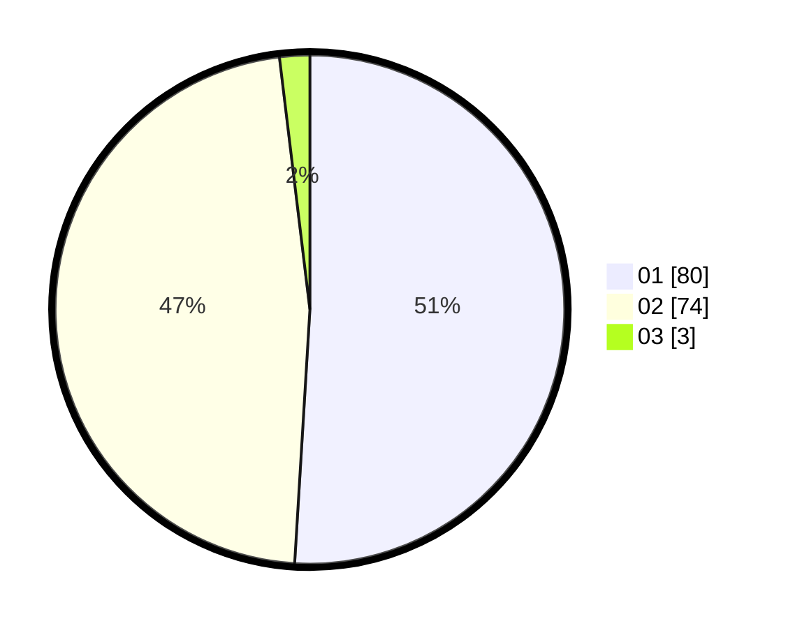

# Hasil

Hasil perolehan suara paslon dapat dilihat pada file paslon-01.txt, paslon-02.txt, dan paslon-03.txt.

Jika tidak ada, artinya data tersebut belum ada pada SIREKAP.

## Perolehan Suara

 * Paslon 01: **80**.
 * Paslon 02: **74**.
 * Paslon 03: **3**.

## Foto C Plano

https://sirekap-obj-formc.kpu.go.id/9bc8/pemilu/ppwp/31/73/04/10/07/3173041007025-20240214-191020--019cbc79-2f3e-4764-868b-3916b8b9b9c3.jpg

https://sirekap-obj-formc.kpu.go.id/9bc8/pemilu/ppwp/31/73/04/10/07/3173041007025-20240214-192648--8d10853f-2484-42ba-88b5-d7cf7f1f8c94.jpg

https://sirekap-obj-formc.kpu.go.id/9bc8/pemilu/ppwp/31/73/04/10/07/3173041007025-20240214-191506--46b0fe9f-81e3-48b0-9dac-fcb98d651e77.jpg

## DATA PEMILIH TETAP

Jumlah pemilih dalam DPT: **241**.
 * L: **128**.
 * P: **113**.

## DATA PENGGUNA HAK PILIH

Jumlah pengguna hak pilih dalam DPT: **157**.
 * L: **78**.
 * P: **79**.

Jumlah pengguna hak pilih dalam DPTb: **0**.
 * L: **0**.
 * P: **0**.

Jumlah pengguna hak pilih dalam DPK: **2**.
 * L: **2**.
 * P: **0**.

Jumlah pengguna hak pilih: **159**.
 * L: **80**.
 * P: **79**.

## JUMLAH SUARA SAH DAN TIDAK SAH

JUMLAH SELURUH SUARA SAH: **157**.

JUMLAH SUARA TIDAK SAH: **2**.

JUMLAH SELURUH SUARA SAH DAN SUARA TIDAK SAH: **159**.
