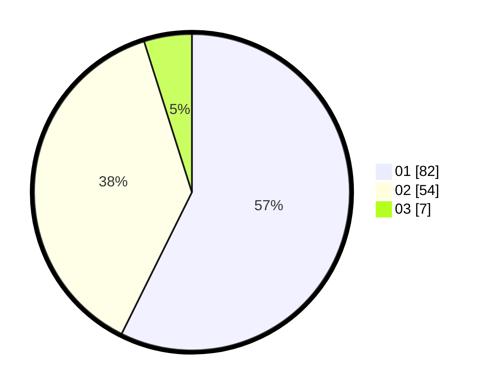

# Hasil

Hasil perolehan suara paslon dapat dilihat pada file paslon-01.txt, paslon-02.txt, dan paslon-03.txt.

Jika tidak ada, artinya data tersebut belum ada pada SIREKAP.

## Perolehan Suara

 * Paslon 01: **82**.
 * Paslon 02: **54**.
 * Paslon 03: **7**.

## Foto C Plano

https://sirekap-obj-formc.kpu.go.id/bd84/pemilu/ppwp/31/73/04/10/07/3173041007026-20240216-213835--eaff4208-394c-4d43-ba37-1f5962bd9cb7.jpg

https://sirekap-obj-formc.kpu.go.id/bd84/pemilu/ppwp/31/73/04/10/07/3173041007026-20240217-171710--412c339a-d520-4f45-bbee-c3c880cd20d2.jpg

https://sirekap-obj-formc.kpu.go.id/bd84/pemilu/ppwp/31/73/04/10/07/3173041007026-20240214-215752--993fd66f-c290-41b3-b67f-b602a7c91d46.jpg
