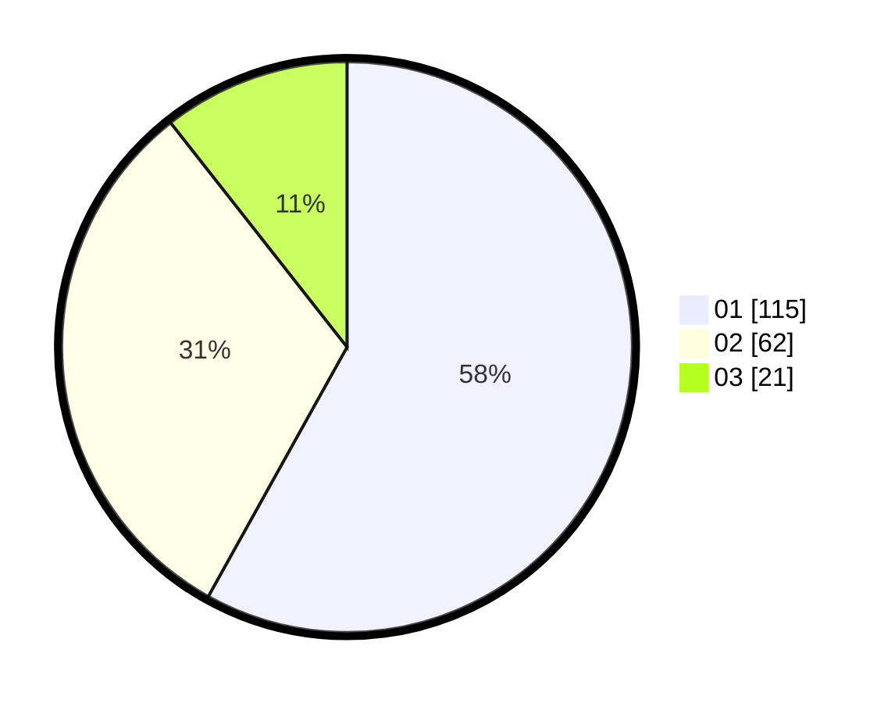

# Hasil

Hasil perolehan suara paslon dapat dilihat pada file paslon-01.txt, paslon-02.txt, dan paslon-03.txt.

Jika tidak ada, artinya data tersebut belum ada pada SIREKAP.

## Perolehan Suara

 * Paslon 01: **115**.
 * Paslon 02: **62**.
 * Paslon 03: **21**.

## Foto C Plano

https://sirekap-obj-formc.kpu.go.id/b7f5/pemilu/ppwp/31/73/04/10/07/3173041007029-20240214-225528--31f4ff18-5bde-493c-a1a1-e3cb17c109af.jpg

https://sirekap-obj-formc.kpu.go.id/b7f5/pemilu/ppwp/31/73/04/10/07/3173041007029-20240214-230218--ae0c8ad0-cac5-4c18-9d9f-9cbf162dd1c8.jpg

https://sirekap-obj-formc.kpu.go.id/b7f5/pemilu/ppwp/31/73/04/10/07/3173041007029-20240214-234318--9ae3a722-083d-48ab-92a3-8ffba3db98c8.jpg
