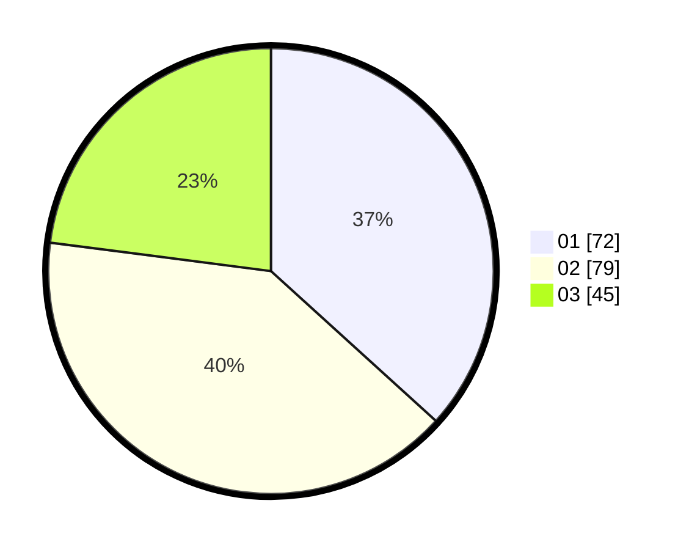

# Hasil

Hasil perolehan suara paslon dapat dilihat pada file paslon-01.txt, paslon-02.txt, dan paslon-03.txt.

Jika tidak ada, artinya data tersebut belum ada pada SIREKAP.

## Perolehan Suara

 * Paslon 01: **72**.
 * Paslon 02: **79**.
 * Paslon 03: **45**.

## Foto C Plano

https://sirekap-obj-formc.kpu.go.id/f675/pemilu/ppwp/31/73/04/10/07/3173041007031-20240215-011933--7c9e31e3-a6e3-41fa-8633-c681f83341f8.jpg

https://sirekap-obj-formc.kpu.go.id/f675/pemilu/ppwp/31/73/04/10/07/3173041007031-20240215-012030--8c85e8ee-07ed-4fe2-92ec-923ecaa51df7.jpg

https://sirekap-obj-formc.kpu.go.id/f675/pemilu/ppwp/31/73/04/10/07/3173041007031-20240215-012359--65d7adac-eb82-4323-b69d-6e59c4c4d2af.jpg
