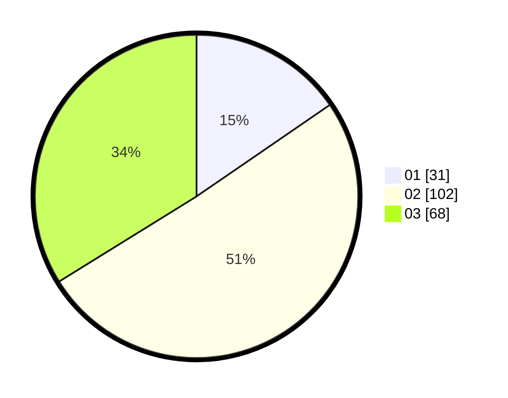

# Hasil

Hasil perolehan suara paslon dapat dilihat pada file paslon-01.txt, paslon-02.txt, dan paslon-03.txt.

Jika tidak ada, artinya data tersebut belum ada pada SIREKAP.

## Perolehan Suara

 * Paslon 01: **31**.
 * Paslon 02: **102**.
 * Paslon 03: **68**.

## Foto C Plano

https://sirekap-obj-formc.kpu.go.id/3ee8/pemilu/ppwp/31/73/04/10/07/3173041007032-20240214-231849--4bcea50b-17a0-4505-bf2c-5836f3a84b2d.jpg

https://sirekap-obj-formc.kpu.go.id/3ee8/pemilu/ppwp/31/73/04/10/07/3173041007032-20240214-231954--1bb1fe2f-6cb0-417d-b6cf-00e0fb376f2e.jpg

https://sirekap-obj-formc.kpu.go.id/3ee8/pemilu/ppwp/31/73/04/10/07/3173041007032-20240214-232015--d0368f47-aa99-4693-81e6-754074dcdba2.jpg
