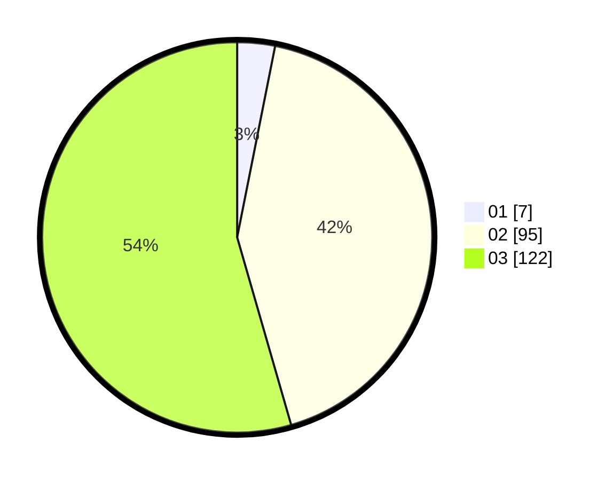

# Hasil

Hasil perolehan suara paslon dapat dilihat pada file paslon-01.txt, paslon-02.txt, dan paslon-03.txt.

Jika tidak ada, artinya data tersebut belum ada pada SIREKAP.

## Perolehan Suara

 * Paslon 01: **7**.
 * Paslon 02: **95**.
 * Paslon 03: **122**.

## Foto C Plano

https://sirekap-obj-formc.kpu.go.id/ac52/pemilu/ppwp/31/73/04/10/07/3173041007034-20240214-233129--e4488ae0-6686-4906-9b7b-e4ec2255573b.jpg

https://sirekap-obj-formc.kpu.go.id/ac52/pemilu/ppwp/31/73/04/10/07/3173041007034-20240214-233322--f5293b05-3033-4c6e-a86a-d4346e246d99.jpg

https://sirekap-obj-formc.kpu.go.id/ac52/pemilu/ppwp/31/73/04/10/07/3173041007034-20240214-233418--827ed509-81f2-4c2f-819e-8a08b2d29320.jpg
