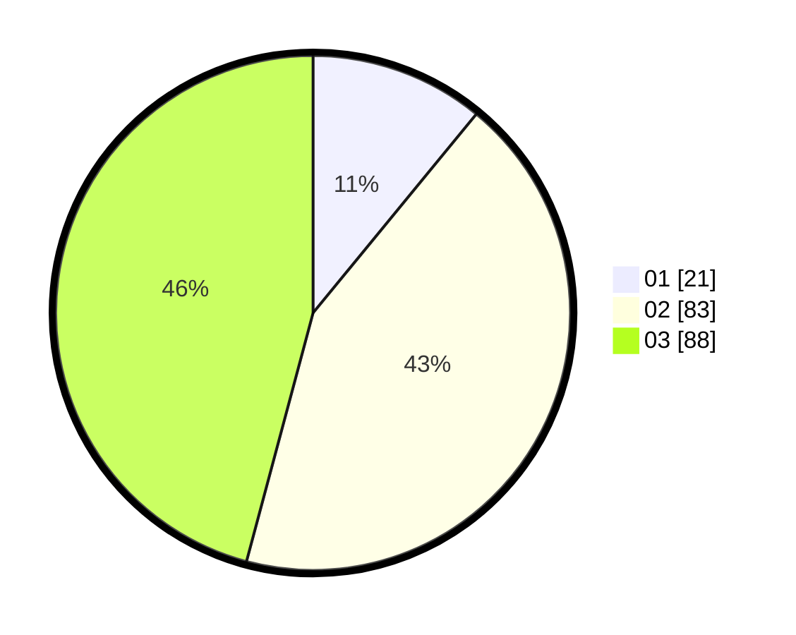

# Hasil

Hasil perolehan suara paslon dapat dilihat pada file paslon-01.txt, paslon-02.txt, dan paslon-03.txt.

Jika tidak ada, artinya data tersebut belum ada pada SIREKAP.

## Perolehan Suara

 * Paslon 01: **21**.
 * Paslon 02: **83**.
 * Paslon 03: **88**.

## Foto C Plano

https://sirekap-obj-formc.kpu.go.id/e026/pemilu/ppwp/31/73/04/10/07/3173041007039-20240214-192144--eed69e93-8cbb-42c3-9acd-fd16b298749e.jpg

https://sirekap-obj-formc.kpu.go.id/e026/pemilu/ppwp/31/73/04/10/07/3173041007039-20240214-191010--44121986-cb65-4bc7-956f-16e796440c4d.jpg

https://sirekap-obj-formc.kpu.go.id/e026/pemilu/ppwp/31/73/04/10/07/3173041007039-20240214-205526--2f9eb7f2-2e24-4465-ac4b-837380d98279.jpg

## DATA PEMILIH TETAP

Jumlah pemilih dalam DPT: **294**.
 * L: **141**.
 * P: **153**.

## DATA PENGGUNA HAK PILIH

Jumlah pengguna hak pilih dalam DPT: **193**.
 * L: **93**.
 * P: **100**.

Jumlah pengguna hak pilih dalam DPTb: **0**.
 * L: **0**.
 * P: **0**.

Jumlah pengguna hak pilih dalam DPK: **0**.
 * L: **0**.
 * P: **0**.

Jumlah pengguna hak pilih: **193**.
 * L: **93**.
 * P: **100**.

## JUMLAH SUARA SAH DAN TIDAK SAH

JUMLAH SELURUH SUARA SAH: **192**.

JUMLAH SUARA TIDAK SAH: **1**.

JUMLAH SELURUH SUARA SAH DAN SUARA TIDAK SAH: **193**.
