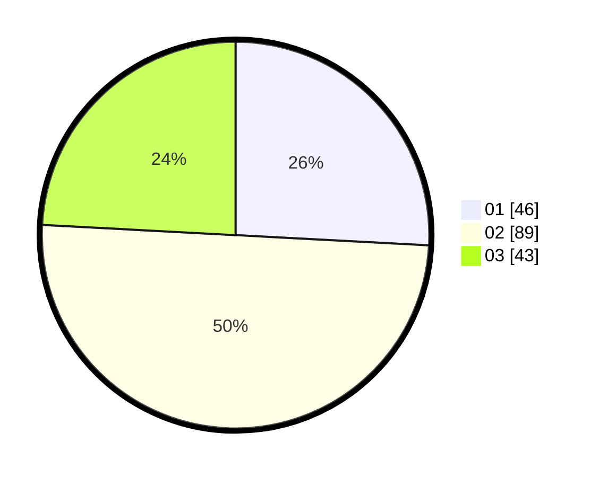

# Hasil

Hasil perolehan suara paslon dapat dilihat pada file paslon-01.txt, paslon-02.txt, dan paslon-03.txt.

Jika tidak ada, artinya data tersebut belum ada pada SIREKAP.

## Perolehan Suara

 * Paslon 01: **46**.
 * Paslon 02: **89**.
 * Paslon 03: **43**.

## Foto C Plano

https://sirekap-obj-formc.kpu.go.id/8ad3/pemilu/ppwp/31/73/04/10/07/3173041007041-20240215-013720--4aab34a3-5939-40e6-a2c7-f6517066418f.jpg

https://sirekap-obj-formc.kpu.go.id/8ad3/pemilu/ppwp/31/73/04/10/07/3173041007041-20240215-013815--0561a7f9-a8fb-4b6b-9614-45f18f04bc43.jpg

https://sirekap-obj-formc.kpu.go.id/8ad3/pemilu/ppwp/31/73/04/10/07/3173041007041-20240214-155333--f22d8923-f226-4022-abf2-cf52297bf2db.jpg
