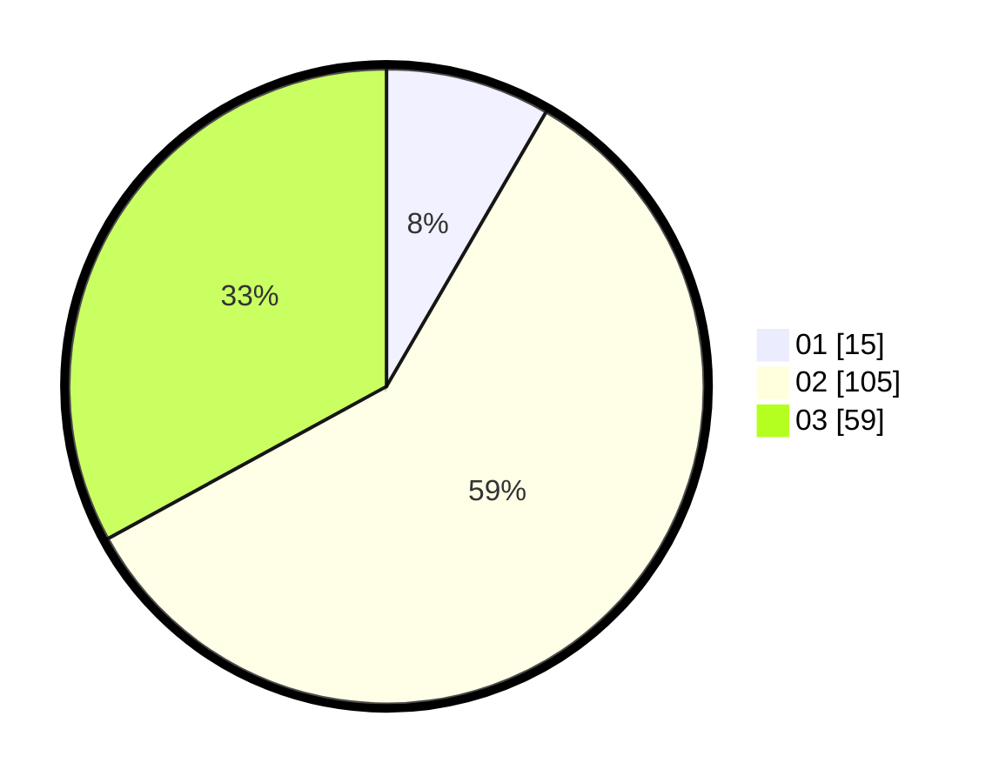

# Hasil

Hasil perolehan suara paslon dapat dilihat pada file paslon-01.txt, paslon-02.txt, dan paslon-03.txt.

Jika tidak ada, artinya data tersebut belum ada pada SIREKAP.

## Perolehan Suara

 * Paslon 01: **15**.
 * Paslon 02: **105**.
 * Paslon 03: **59**.

## Foto C Plano

https://sirekap-obj-formc.kpu.go.id/2a5f/pemilu/ppwp/31/73/04/10/07/3173041007044-20240214-200456--0d94b296-956d-4ded-8263-4b656dece461.jpg

https://sirekap-obj-formc.kpu.go.id/2a5f/pemilu/ppwp/31/73/04/10/07/3173041007044-20240214-202953--81dc28d6-0e1d-41ec-bbe3-a20f6a82199a.jpg

https://sirekap-obj-formc.kpu.go.id/2a5f/pemilu/ppwp/31/73/04/10/07/3173041007044-20240214-201308--24400cff-1560-429a-8498-493d221bc0c2.jpg
