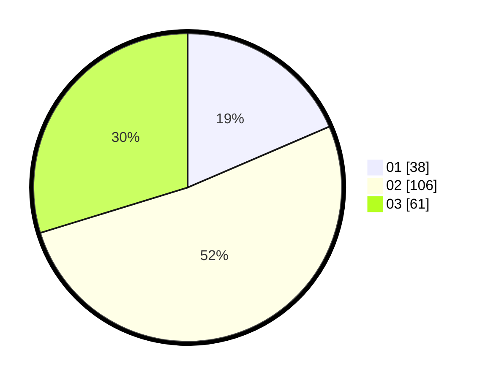

# Hasil

Hasil perolehan suara paslon dapat dilihat pada file paslon-01.txt, paslon-02.txt, dan paslon-03.txt.

Jika tidak ada, artinya data tersebut belum ada pada SIREKAP.

## Perolehan Suara

 * Paslon 01: **38**.
 * Paslon 02: **106**.
 * Paslon 03: **61**.

## Foto C Plano

https://sirekap-obj-formc.kpu.go.id/2b9c/pemilu/ppwp/31/73/04/10/07/3173041007050-20240215-011847--29994c06-b6ea-4516-be84-6b5440dd0440.jpg

https://sirekap-obj-formc.kpu.go.id/2b9c/pemilu/ppwp/31/73/04/10/07/3173041007050-20240215-012049--6a0c28cc-a266-411a-a2ea-f42adc110ead.jpg

https://sirekap-obj-formc.kpu.go.id/2b9c/pemilu/ppwp/31/73/04/10/07/3173041007050-20240215-012156--0b1c4250-7c76-4551-b675-3d93acac7afe.jpg
