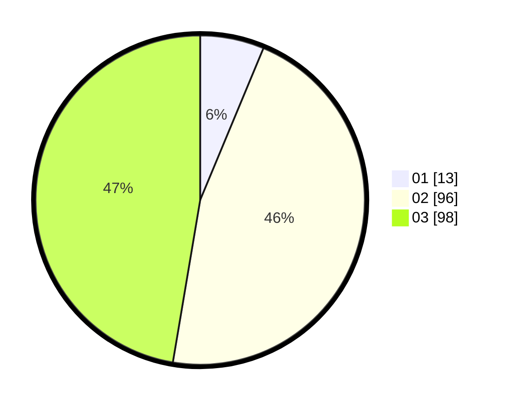

# Hasil

Hasil perolehan suara paslon dapat dilihat pada file paslon-01.txt, paslon-02.txt, dan paslon-03.txt.

Jika tidak ada, artinya data tersebut belum ada pada SIREKAP.

## Perolehan Suara

 * Paslon 01: **13**.
 * Paslon 02: **96**.
 * Paslon 03: **98**.

## Foto C Plano

https://sirekap-obj-formc.kpu.go.id/49c7/pemilu/ppwp/31/73/04/10/07/3173041007052-20240214-220609--b1879c0b-86a5-44ca-ae41-0d2d9b5c781b.jpg

https://sirekap-obj-formc.kpu.go.id/49c7/pemilu/ppwp/31/73/04/10/07/3173041007052-20240215-020518--3172dd56-051f-4d21-90ae-572dd576ddc8.jpg

https://sirekap-obj-formc.kpu.go.id/49c7/pemilu/ppwp/31/73/04/10/07/3173041007052-20240214-220942--c9cb6b6d-f047-4d7b-bbc0-3c56dfa3b181.jpg
