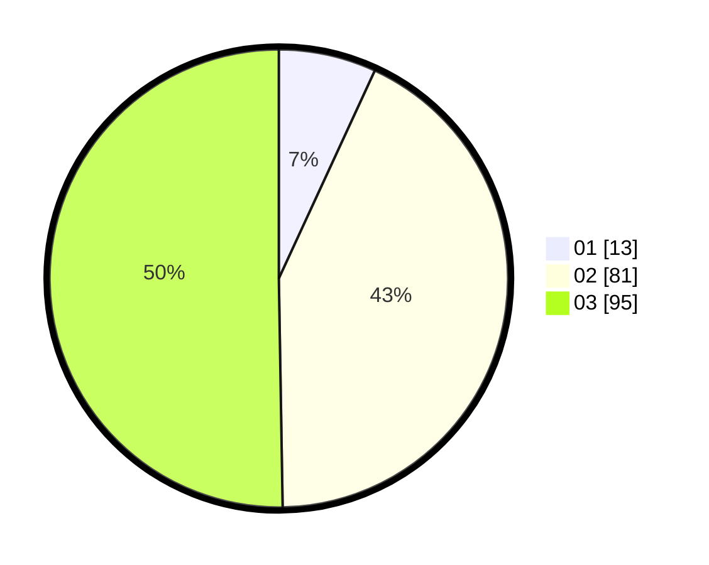

# Hasil

Hasil perolehan suara paslon dapat dilihat pada file paslon-01.txt, paslon-02.txt, dan paslon-03.txt.

Jika tidak ada, artinya data tersebut belum ada pada SIREKAP.

## Perolehan Suara

 * Paslon 01: **13**.
 * Paslon 02: **81**.
 * Paslon 03: **95**.

## Foto C Plano

https://sirekap-obj-formc.kpu.go.id/e203/pemilu/ppwp/31/73/04/10/07/3173041007054-20240215-030848--47ccbd30-5606-4956-a7c1-6e948c024f9d.jpg

https://sirekap-obj-formc.kpu.go.id/e203/pemilu/ppwp/31/73/04/10/07/3173041007054-20240215-030931--9ee6e24b-76fc-4703-8959-f370aea709b2.jpg

https://sirekap-obj-formc.kpu.go.id/e203/pemilu/ppwp/31/73/04/10/07/3173041007054-20240215-031115--9fbfc61a-96aa-40c5-8740-8a7490e4e956.jpg
