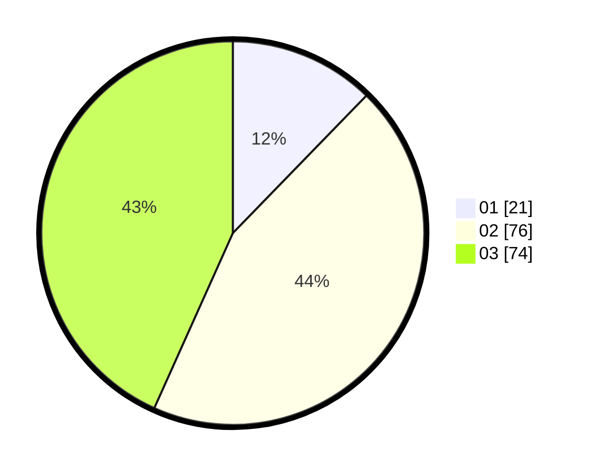

# Hasil

Hasil perolehan suara paslon dapat dilihat pada file paslon-01.txt, paslon-02.txt, dan paslon-03.txt.

Jika tidak ada, artinya data tersebut belum ada pada SIREKAP.

## Perolehan Suara

 * Paslon 01: **21**.
 * Paslon 02: **76**.
 * Paslon 03: **74**.

## Foto C Plano

https://sirekap-obj-formc.kpu.go.id/5d6b/pemilu/ppwp/31/73/04/10/07/3173041007059-20240214-190034--1a651ff4-4b94-4563-9889-e40791e59f54.jpg

https://sirekap-obj-formc.kpu.go.id/5d6b/pemilu/ppwp/31/73/04/10/07/3173041007059-20240214-185851--9995546d-c517-41a6-a983-591995f8ed9e.jpg

https://sirekap-obj-formc.kpu.go.id/5d6b/pemilu/ppwp/31/73/04/10/07/3173041007059-20240214-185925--9fc611c6-9a36-48bb-803a-6544945914e4.jpg

## DATA PEMILIH TETAP

Jumlah pemilih dalam DPT: **255**.
 * L: **136**.
 * P: **119**.

## DATA PENGGUNA HAK PILIH

Jumlah pengguna hak pilih dalam DPT: **170**.
 * L: **87**.
 * P: **83**.

Jumlah pengguna hak pilih dalam DPTb: **2**.
 * L: **2**.
 * P: **0**.

Jumlah pengguna hak pilih dalam DPK: **4**.
 * L: **2**.
 * P: **2**.

Jumlah pengguna hak pilih: **176**.
 * L: **91**.
 * P: **85**.

## JUMLAH SUARA SAH DAN TIDAK SAH

JUMLAH SELURUH SUARA SAH: **171**.

JUMLAH SUARA TIDAK SAH: **5**.

JUMLAH SELURUH SUARA SAH DAN SUARA TIDAK SAH: **176**.
