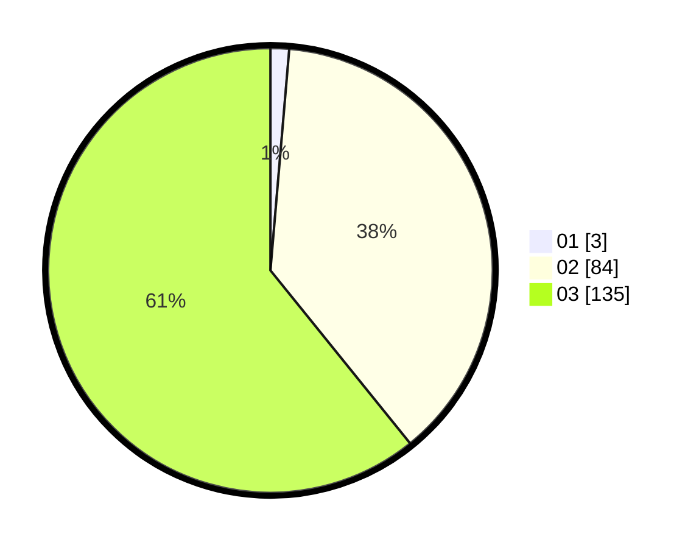

# Hasil

Hasil perolehan suara paslon dapat dilihat pada file paslon-01.txt, paslon-02.txt, dan paslon-03.txt.

Jika tidak ada, artinya data tersebut belum ada pada SIREKAP.

## Perolehan Suara

 * Paslon 01: **3**.
 * Paslon 02: **84**.
 * Paslon 03: **135**.

## Foto C Plano

https://sirekap-obj-formc.kpu.go.id/de65/pemilu/ppwp/31/73/04/10/07/3173041007061-20240214-224551--545a22ab-5858-4b68-ba55-726b8afb4461.jpg

https://sirekap-obj-formc.kpu.go.id/de65/pemilu/ppwp/31/73/04/10/07/3173041007061-20240214-205816--4140b632-8e03-4a21-a3da-c5685ac61285.jpg

https://sirekap-obj-formc.kpu.go.id/de65/pemilu/ppwp/31/73/04/10/07/3173041007061-20240214-205925--25dbeea5-6032-49af-adeb-8dc568a8c2cd.jpg
