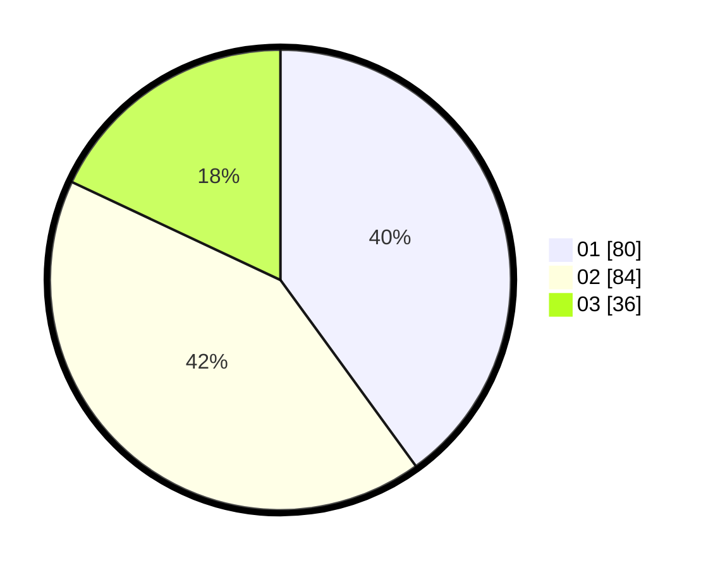

# Hasil

Hasil perolehan suara paslon dapat dilihat pada file paslon-01.txt, paslon-02.txt, dan paslon-03.txt.

Jika tidak ada, artinya data tersebut belum ada pada SIREKAP.

## Perolehan Suara

 * Paslon 01: **80**.
 * Paslon 02: **84**.
 * Paslon 03: **36**.

## Foto C Plano

https://sirekap-obj-formc.kpu.go.id/4128/pemilu/ppwp/31/73/04/10/07/3173041007067-20240214-214950--835a6e1a-16b8-4920-ae1a-ff4e139b728c.jpg

https://sirekap-obj-formc.kpu.go.id/4128/pemilu/ppwp/31/73/04/10/07/3173041007067-20240214-215122--eabac793-dce3-449a-9bbe-1141af820e7e.jpg

https://sirekap-obj-formc.kpu.go.id/4128/pemilu/ppwp/31/73/04/10/07/3173041007067-20240214-224648--c42b2f1c-14e2-45f0-b953-e2362f50b085.jpg
