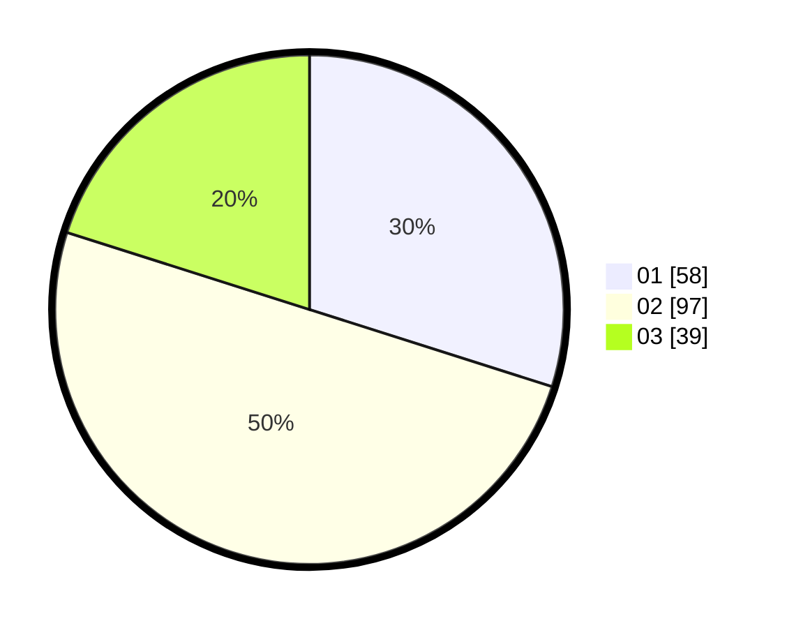

# Hasil

Hasil perolehan suara paslon dapat dilihat pada file paslon-01.txt, paslon-02.txt, dan paslon-03.txt.

Jika tidak ada, artinya data tersebut belum ada pada SIREKAP.

## Perolehan Suara

 * Paslon 01: **58**.
 * Paslon 02: **97**.
 * Paslon 03: **39**.

## Foto C Plano

https://sirekap-obj-formc.kpu.go.id/dd45/pemilu/ppwp/31/73/04/10/07/3173041007068-20240214-204328--2fd7f655-56fa-41bd-9c40-fe240204811c.jpg

https://sirekap-obj-formc.kpu.go.id/dd45/pemilu/ppwp/31/73/04/10/07/3173041007068-20240215-000331--20ee4fcc-8731-4f09-9802-c45582ee8ce9.jpg

https://sirekap-obj-formc.kpu.go.id/dd45/pemilu/ppwp/31/73/04/10/07/3173041007068-20240215-000417--1be0f9f2-253b-4173-bcd7-8ab90ea52b08.jpg

## DATA PEMILIH TETAP

Jumlah pemilih dalam DPT: **268**.
 * L: **140**.
 * P: **128**.

## DATA PENGGUNA HAK PILIH

Jumlah pengguna hak pilih dalam DPT: **198**.
 * L: **100**.
 * P: **98**.

Jumlah pengguna hak pilih dalam DPTb: **0**.
 * L: **0**.
 * P: **0**.

Jumlah pengguna hak pilih dalam DPK: **2**.
 * L: **2**.
 * P: **0**.

Jumlah pengguna hak pilih: **200**.
 * L: **102**.
 * P: **98**.

## JUMLAH SUARA SAH DAN TIDAK SAH

JUMLAH SELURUH SUARA SAH: **194**.

JUMLAH SUARA TIDAK SAH: **6**.

JUMLAH SELURUH SUARA SAH DAN SUARA TIDAK SAH: **200**.
