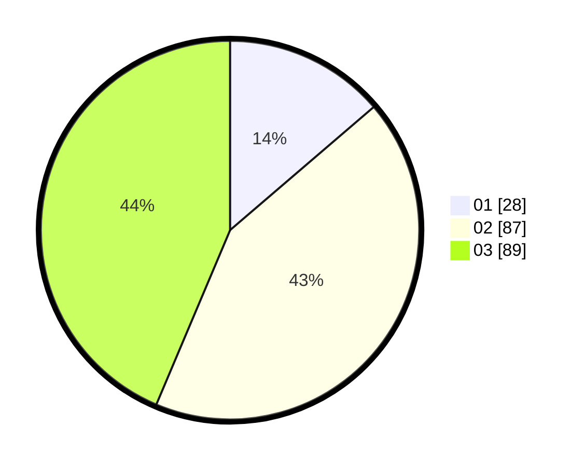

# Hasil

Hasil perolehan suara paslon dapat dilihat pada file paslon-01.txt, paslon-02.txt, dan paslon-03.txt.

Jika tidak ada, artinya data tersebut belum ada pada SIREKAP.

## Perolehan Suara

 * Paslon 01: **28**.
 * Paslon 02: **87**.
 * Paslon 03: **89**.

## Foto C Plano

https://sirekap-obj-formc.kpu.go.id/7196/pemilu/ppwp/31/73/04/10/07/3173041007070-20240214-225557--e0ea2894-9429-4b7d-aacb-55b2d463a28b.jpg

https://sirekap-obj-formc.kpu.go.id/7196/pemilu/ppwp/31/73/04/10/07/3173041007070-20240214-225507--74e041fe-30c6-4279-8d7b-d4196328da42.jpg

https://sirekap-obj-formc.kpu.go.id/7196/pemilu/ppwp/31/73/04/10/07/3173041007070-20240214-225405--58bf6e0c-9387-4797-8546-a2faa63ade32.jpg
