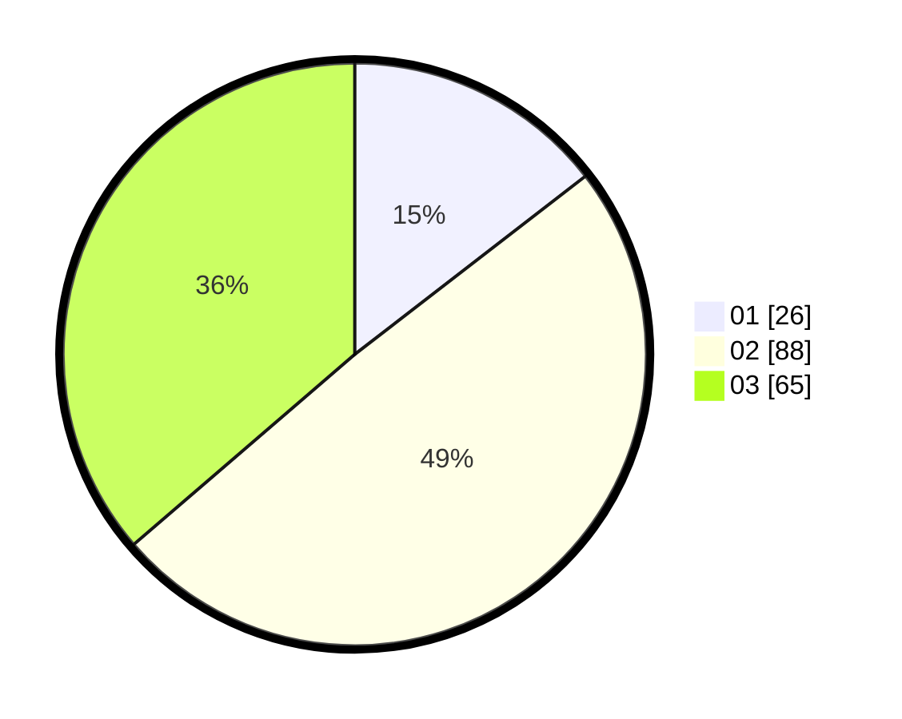

# Hasil

Hasil perolehan suara paslon dapat dilihat pada file paslon-01.txt, paslon-02.txt, dan paslon-03.txt.

Jika tidak ada, artinya data tersebut belum ada pada SIREKAP.

## Perolehan Suara

 * Paslon 01: **26**.
 * Paslon 02: **88**.
 * Paslon 03: **65**.

## Foto C Plano

https://sirekap-obj-formc.kpu.go.id/eb98/pemilu/ppwp/31/73/04/10/07/3173041007074-20240214-201553--cfe84880-af4b-4d1f-b8f2-ec0eccfbb23f.jpg

https://sirekap-obj-formc.kpu.go.id/eb98/pemilu/ppwp/31/73/04/10/07/3173041007074-20240214-225053--08dd6223-a035-4d46-bd42-89b7b76e3d54.jpg

https://sirekap-obj-formc.kpu.go.id/eb98/pemilu/ppwp/31/73/04/10/07/3173041007074-20240214-201812--f8cfc77e-9631-4b93-a23c-e5f13137e8e4.jpg

## DATA PEMILIH TETAP

Jumlah pemilih dalam DPT: **242**.
 * L: **125**.
 * P: **117**.

## DATA PENGGUNA HAK PILIH

Jumlah pengguna hak pilih dalam DPT: **176**.
 * L: **91**.
 * P: **85**.

Jumlah pengguna hak pilih dalam DPTb: **4**.
 * L: **2**.
 * P: **2**.

Jumlah pengguna hak pilih dalam DPK: **1**.
 * L: **0**.
 * P: **1**.

Jumlah pengguna hak pilih: **181**.
 * L: **93**.
 * P: **88**.

## JUMLAH SUARA SAH DAN TIDAK SAH

JUMLAH SELURUH SUARA SAH: **179**.

JUMLAH SUARA TIDAK SAH: **2**.

JUMLAH SELURUH SUARA SAH DAN SUARA TIDAK SAH: **181**.
