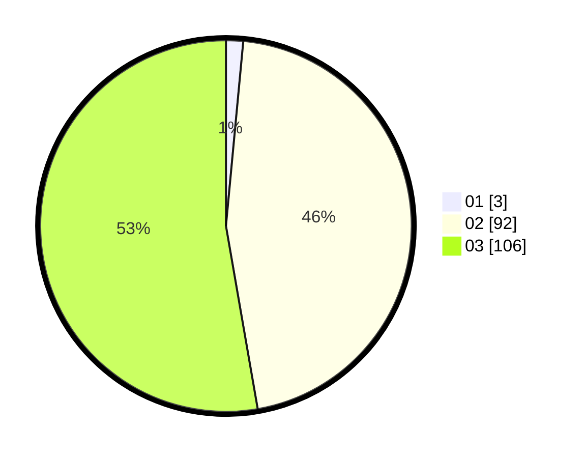

# Hasil

Hasil perolehan suara paslon dapat dilihat pada file paslon-01.txt, paslon-02.txt, dan paslon-03.txt.

Jika tidak ada, artinya data tersebut belum ada pada SIREKAP.

## Perolehan Suara

 * Paslon 01: **3**.
 * Paslon 02: **92**.
 * Paslon 03: **106**.

## Foto C Plano

https://sirekap-obj-formc.kpu.go.id/aac8/pemilu/ppwp/31/73/04/10/07/3173041007078-20240215-002752--c23c8fac-a413-4e07-af03-531974906779.jpg

https://sirekap-obj-formc.kpu.go.id/aac8/pemilu/ppwp/31/73/04/10/07/3173041007078-20240214-232656--0b9325bb-8f83-478e-9d0a-14c8646ef584.jpg

https://sirekap-obj-formc.kpu.go.id/aac8/pemilu/ppwp/31/73/04/10/07/3173041007078-20240215-002830--f7a5a015-cefc-481a-989d-6ceb33fff57a.jpg
