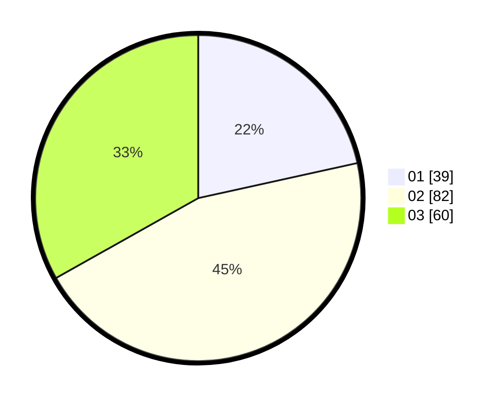

# Hasil

Hasil perolehan suara paslon dapat dilihat pada file paslon-01.txt, paslon-02.txt, dan paslon-03.txt.

Jika tidak ada, artinya data tersebut belum ada pada SIREKAP.

## Perolehan Suara

 * Paslon 01: **39**.
 * Paslon 02: **82**.
 * Paslon 03: **60**.

## Foto C Plano

https://sirekap-obj-formc.kpu.go.id/2212/pemilu/ppwp/31/73/04/10/07/3173041007079-20240215-000911--76c1a1f1-744b-4aff-9f14-c77abbc2568b.jpg

https://sirekap-obj-formc.kpu.go.id/2212/pemilu/ppwp/31/73/04/10/07/3173041007079-20240215-001015--e287f255-e4b0-4397-96f5-88765b2555d5.jpg

https://sirekap-obj-formc.kpu.go.id/2212/pemilu/ppwp/31/73/04/10/07/3173041007079-20240215-001230--04d6d850-0b65-4487-a25d-c8e0f28ecbf7.jpg
