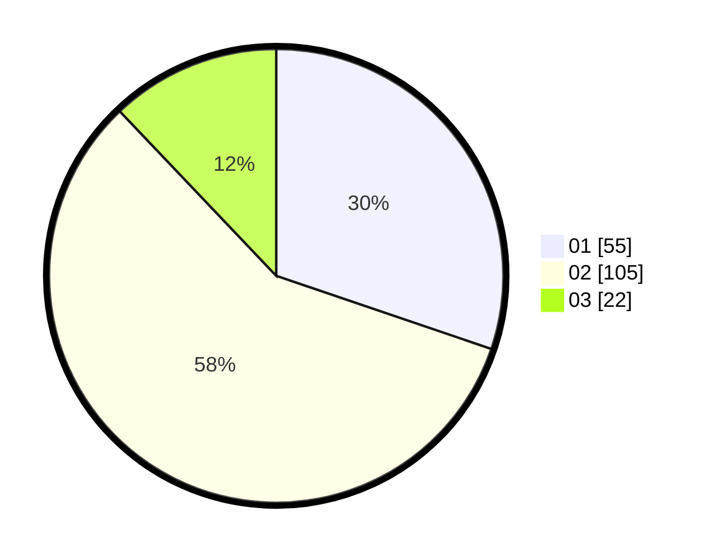

# Hasil

Hasil perolehan suara paslon dapat dilihat pada file paslon-01.txt, paslon-02.txt, dan paslon-03.txt.

Jika tidak ada, artinya data tersebut belum ada pada SIREKAP.

## Perolehan Suara

 * Paslon 01: **55**.
 * Paslon 02: **105**.
 * Paslon 03: **22**.

## Foto C Plano

https://sirekap-obj-formc.kpu.go.id/53b7/pemilu/ppwp/31/73/04/10/07/3173041007082-20240214-225943--5ee60915-bab4-4b86-8662-6aa5406d93f3.jpg

https://sirekap-obj-formc.kpu.go.id/53b7/pemilu/ppwp/31/73/04/10/07/3173041007082-20240214-230044--890f3088-10da-420a-a492-e56eab971007.jpg

https://sirekap-obj-formc.kpu.go.id/53b7/pemilu/ppwp/31/73/04/10/07/3173041007082-20240214-230122--cc76343d-a529-4860-8540-993b28217486.jpg
