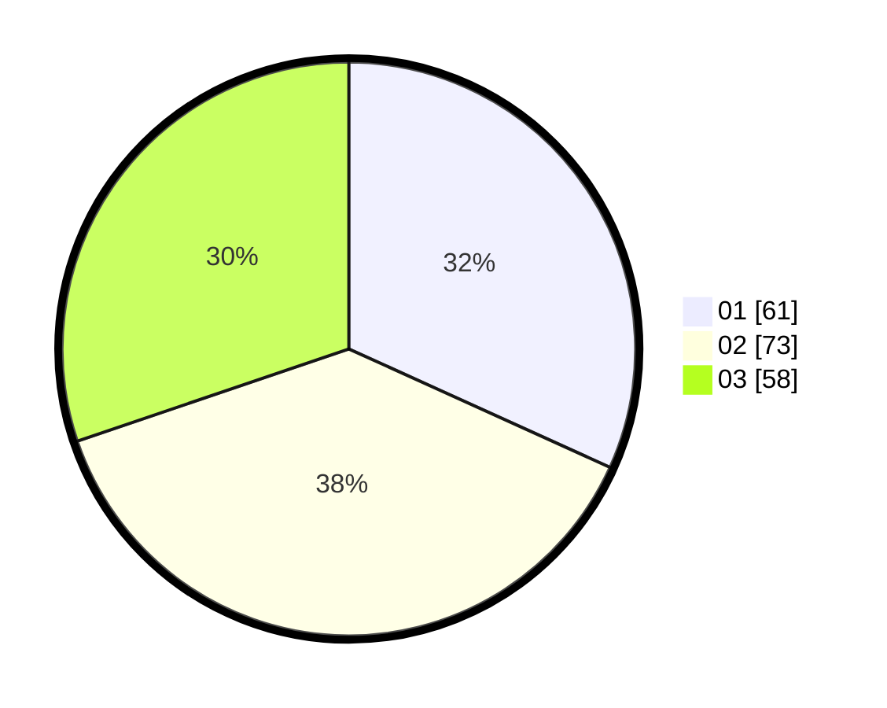

# Hasil

Hasil perolehan suara paslon dapat dilihat pada file paslon-01.txt, paslon-02.txt, dan paslon-03.txt.

Jika tidak ada, artinya data tersebut belum ada pada SIREKAP.

## Perolehan Suara

 * Paslon 01: **61**.
 * Paslon 02: **73**.
 * Paslon 03: **58**.

## Foto C Plano

https://sirekap-obj-formc.kpu.go.id/f88e/pemilu/ppwp/31/73/04/10/07/3173041007089-20240214-192112--4a778d5a-a4ec-4fe3-8ae2-7e0a030be1fc.jpg

https://sirekap-obj-formc.kpu.go.id/f88e/pemilu/ppwp/31/73/04/10/07/3173041007089-20240214-191834--b7a1170a-b84b-4f80-8457-8e940aae0dcc.jpg

https://sirekap-obj-formc.kpu.go.id/f88e/pemilu/ppwp/31/73/04/10/07/3173041007089-20240214-191838--b6e7a5a4-376c-449e-af3a-30eebbd955ab.jpg

## DATA PEMILIH TETAP

Jumlah pemilih dalam DPT: **253**.
 * L: **141**.
 * P: **112**.

## DATA PENGGUNA HAK PILIH

Jumlah pengguna hak pilih dalam DPT: **192**.
 * L: **103**.
 * P: **89**.

Jumlah pengguna hak pilih dalam DPTb: **1**.
 * L: **0**.
 * P: **1**.

Jumlah pengguna hak pilih dalam DPK: **2**.
 * L: **0**.
 * P: **2**.

Jumlah pengguna hak pilih: **195**.
 * L: **103**.
 * P: **92**.

## JUMLAH SUARA SAH DAN TIDAK SAH

JUMLAH SELURUH SUARA SAH: **192**.

JUMLAH SUARA TIDAK SAH: **3**.

JUMLAH SELURUH SUARA SAH DAN SUARA TIDAK SAH: **195**.
