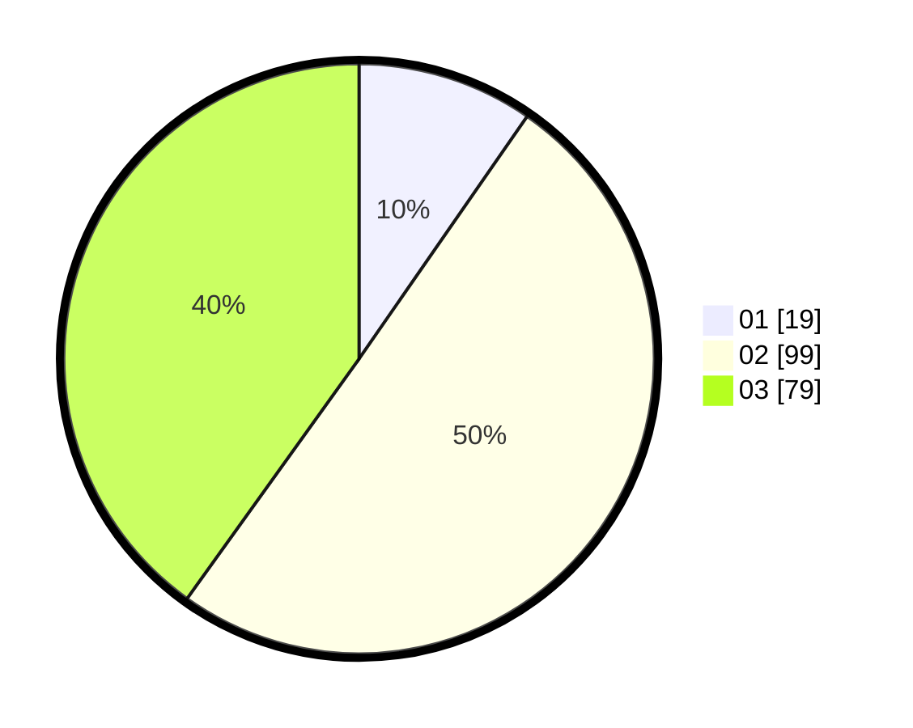

# Hasil

Hasil perolehan suara paslon dapat dilihat pada file paslon-01.txt, paslon-02.txt, dan paslon-03.txt.

Jika tidak ada, artinya data tersebut belum ada pada SIREKAP.

## Perolehan Suara

 * Paslon 01: **19**.
 * Paslon 02: **99**.
 * Paslon 03: **79**.

## Foto C Plano

https://sirekap-obj-formc.kpu.go.id/6fd8/pemilu/ppwp/31/73/04/10/07/3173041007090-20240215-000115--6035f731-fcfd-462a-a025-01ed5645667f.jpg

https://sirekap-obj-formc.kpu.go.id/6fd8/pemilu/ppwp/31/73/04/10/07/3173041007090-20240215-000527--0a1536a7-e9d1-4cc7-a979-d41d16b81819.jpg

https://sirekap-obj-formc.kpu.go.id/6fd8/pemilu/ppwp/31/73/04/10/07/3173041007090-20240215-000947--e7c31faf-9470-48dd-ab40-b93585967c2a.jpg
