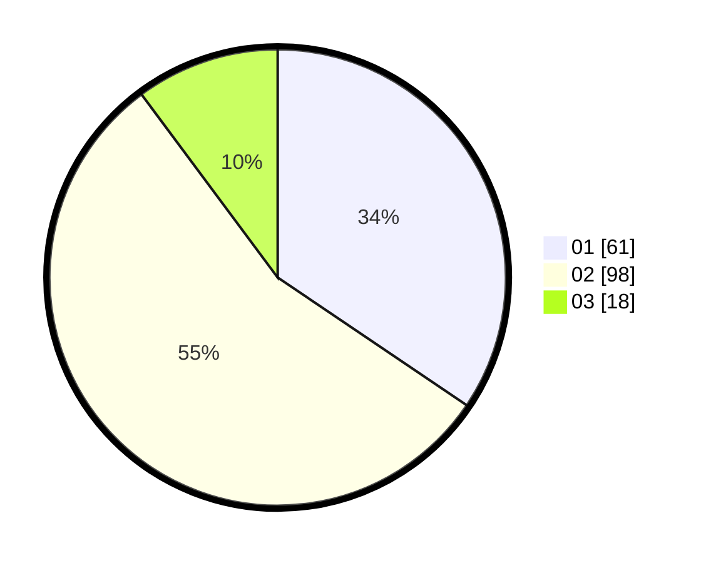

# Hasil

Hasil perolehan suara paslon dapat dilihat pada file paslon-01.txt, paslon-02.txt, dan paslon-03.txt.

Jika tidak ada, artinya data tersebut belum ada pada SIREKAP.

## Perolehan Suara

 * Paslon 01: **61**.
 * Paslon 02: **98**.
 * Paslon 03: **18**.

## Foto C Plano

https://sirekap-obj-formc.kpu.go.id/6853/pemilu/ppwp/31/73/04/10/07/3173041007091-20240215-211348--1f1da928-b633-49d8-b30b-00fbcacca97f.jpg

https://sirekap-obj-formc.kpu.go.id/6853/pemilu/ppwp/31/73/04/10/07/3173041007091-20240214-231244--692c1838-f25b-4858-8241-f690bcdd3143.jpg

https://sirekap-obj-formc.kpu.go.id/6853/pemilu/ppwp/31/73/04/10/07/3173041007091-20240214-231644--6c04d958-bdd3-487c-af70-3f7fa2696d9d.jpg
